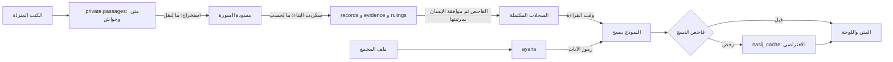

<div dir="rtl">

# شكل السجل وجداول قاعدة البيانات (اقتراح، النسخة الثانية، م-003 وم-005)

> **الوسم:** كل ما في هذا الملف اقتراح (ج)، إلا ما وُسم (أ) إحالةً إلى صف في [سجل القرارات](../decisions.md). وما وُسم (ب) تحققتُ منه بتشغيل سكربت على ملفات القرص.
>
> **كلمتان يجب التفريق بينهما:** «**المقطع**» جزء من السورة، وجدوله `segments`. و«**القطعة**» جزء من نص كتاب نزّلناه، وجدولها `passages`.
>
> **النسخة الأولى** كتبها ممر `think` في 4 أكتوبر 2026. **والنسخة الثانية** كتبها `deep-analyst` في اليوم نفسه، بعد [تجربة سجلات الكوثر](../05-examples/kawthar-records-test.md)، ثم حُوّلت سجلات الكوثر إليها وشُغّل الفحص عليها (القسم 5).
>
> **الأجوبة المؤقتة:** ستة مواضع في هذه النسخة مبنية على أجوبة مؤقتة (ج) من المنسّق، قد يغيّرها صاحب الفكرة. كل واحد منها مفتاح يتغير في موضع واحد (القسم 6).

---

## ما تغيّر عن النسخة الأولى

| # | التغيير | السبب في سطر |
|---|---|---|
| 1 | `buildable` المنطقي صار **إذن البناء** `build_permission`: قرار من ثلاث قيم («نعم»، «معلّق»، «لا») ومعه رمز السبب ونصه | في الكوثر 14 سجلًّا معلّقة لخمسة أسباب مختلفة، والسبب هو ما يحتاجه المراجع |
| 2 | **إذن العرض** `display` حقل منفصل عن إذن البناء | رواية إذن بنائها «معلّق» قد تُعرض في التعمق وحده نقلًا حرفيًّا؛ والحقل الواحد لا يقول الأمرين |
| 3 | **الحقول الثلاثة على كل دليل:** تحقق النقل، وحالة الحكم المنقول، وإذن البناء. وإذن السجل **يُحسب** منها بقاعدة مكتوبة (2.7) | رواية كعب (r30) فيها أربعة أدلة بأحوال مختلفة، وحقل واحد على السجل يخفي ذلك |
| 4 | **جدول فرعي للأحكام المنقولة** `rulings`: اللفظ، والنطاق، والحاكم، وموضع الحكم، والواسطة، والاتجاه، وكيف رُبط بدليله | `grading_text` و`grader_name` مفردان، ورواية واحدة فيها خمسة أحكام من ثلاثة كتب |
| 5 | حُذفت `grading_text` و`grading_verdict` و`grader_name` و`grading_source_id` و`grading_locator` | انتقلت إلى الجدول الفرعي. و`grading_verdict` ترجمة للفظ إلى مرتبة، والمهارة تمنعها |
| 6 | `verified_at_source` المنطقي صار `transfer_status` بثلاث قيم، ومعه `origin_work` و`origin_source_id` و`origin_ref`. و`transmitted_via` دخل في `origin_work` | المهارة تحتاج «متحقق عن الواسطة». وخطوة «إعادة الفتح من الأصل» تحتاج أن تعرف أي أصل تفتح |
| 7 | `passage_id` صار `passage_ref`: الملف، والصف، وهل الاقتباس من **المتن** أم من **الحاشية**. والحاشية قطعة منفصلة. و`page_url` اختياري | جدول القطع لم يُبنَ. والحكم في الحاشية. و60 دليلًا من 69 بلا رابط صفحة |
| 8 | `claim_kind`: الدعوى «اقتباس» أم «صياغة أو تركيب». ودعوى الدليل الحامل الواحد تُكتب اقتباسًا مقتطعًا | إعادة الصياغة مكانها النسيج وقت القراءة. ومرتبة موافقة الإنسان تُحسب من هذا الحقل |
| 9 | `review_tier` محسوب. و**اكتمال السجل** حالة يحسبها الفاحص، ولا تُعلن تغطية آية قبلها | موافقة الإنسان على كل سجل نحو 50 ساعة لجزء عمّ (تقدير التجربة، ج) |
| 10 | **الهداية:** دليلها أيقونة `hidaya` **ومعها** مصدر وقائل واقتباس. حُذف «بلا مصدر» من S4 | الهداية لا تُستنبط (أ، ق-014)، وكان المخطط والمهارة متعارضين فيها |
| 11 | **وحدة السجل:** السجل دعوى واحدة هي مدخل اللوحة. والدليل طريق واحد. والمهارة عُدّلت لتوافق | لو كان السجل طريقًا واحدًا لصارت رواية كعب أربعة سجلات بدعوى واحدة، واللوحة تعرض مدخلًا واحدًا بأدلته (أ، ق-024) |
| 12 | **S8** يقارن **الحاكم** لا رقم المصدر. و**S10** لا يطلب طرفين لمقصد السورة | حكم المحقق في حاشية الكتاب نفسه حكمٌ من غير المؤلف. والمقصد حكم على السورة كلها، لا صلة بين طرفين |
| 13 | حقول زادت لأن التجربة احتاجتها: `claim_supported_by`، و`differences`، و`judgments`، و`nuzul_wording`، و`sources.edition_editor`. و`narration_kind` صار قائمة: مرفوع، موقوف، مقطوع، غير محدد | كلها استُعملت في سجلات الكوثر، وكانت خارج المخطط |
| 14 | سجل بلا دليل يُقبل في حالة واحدة: «معلّق، لا مصدر» | خبر السيرة في الكوثر لا مصدر له في المجموعة الأساسية |

**ما لم يُضف، مع أن النسخة الأولى من السجلات استعملته:**

- `function` (الوظيفة): يُستخرج من `kind` و`topic` ونوع المصدر.
- سلسلة المصدر حلقةً حلقة: يكفي عنها `origin_work`، و`passage_ref`، وصف المصدر.
- `mentions_event_before_revelation`: دخل نصًّا في `note`، وبقي `nuzul_wording` بلفظ الصيغة.
- معيار «مشهور» للرواية التي لا تثبت: أُسقط، وحلّ محله معيار يُفحص آليًّا (2.7).
- قيم جديدة في `genre`، وقاعدة لمن يحدد `depth_min`: لم تحتجهما التجربة لتعمل، وهما في القسم 7.

**ما لم يتغير:** طبقات البيانات، والجداول `ayahs` و`segments` و`nasij_cache`، وحقول الرابط الاجتهادي (2.5)، وحقول الشبهة والإشكال والنبذة. لم تُختبر في الكوثر، فلم أمسّها.

---

## 0. الفكرة في سطور (ج)

- **السجل دعوى واحدة، وهو مدخل اللوحة.** والدليل طريق واحد: اقتباس واحد من موضع واحد. والحكم المنقول صف في جدول فرعي تحت دليله. فالجداول ثلاثة: `records`، و`evidence`، و`rulings`.
- **النموذج ينقل ولا يحكم.** وكيل الاستخراج يكتب ما يُنقل: الدعوى، والاقتباس وموضعه، ولفظ كل حكم وقائله وموضعه. والسكربت يحسب كل ما يُحسب: تحقق النقل، وحالة الحكم، وإذن البناء، وإذن العرض، والشارة، ومرتبة الموافقة.
- **القراءة لا تحتاج متجهات.** جزء عمّ يُقرأ بمفتاح الآية: نجلب سجلات آيات المقطع، ثم ننسج منها. والمتجهات لعملين اثنين: بناء السجلات من الكتب التي لا ترتيب لها بالآيات، والبحث عن جواب لسؤال يكتبه القارئ بنفسه.
- **لا يرى النموذج نص الكتب وقت القراءة.** يرى السجلات المكتملة وحدها، ويكتب رمزًا مكان الآية لا نصها.
- **ثمانية جداول:** `ayahs`، و`sources`، و`segments`، و`records`، و`evidence`، و`rulings`، و`nasij_cache`، و`private.passages`. وتفضيلات الجلسة تبقى في المتصفح حتى يُحسم ق-057.
- **«سوبابيز» نفسه لم يُحسم.** الجداول هنا Postgres عادية فيها pgvector، فتصلح له ولغيره.

---

## 1. طبقات البيانات (ج)

| الطبقة | ما هي | من أين | أين تُخزَّن | تُستعمل في | هل ينسج منها النموذج؟ |
|---|---|---|---|---|---|
| **أ. نص الآية** | 6236 آية بالرسم العثماني والإملائي | `hafsData_v2-0.json` (أ، ق-038) | `ayahs`، عامة | العرض، ومطابقة آية يذكرها القارئ، وفحص الآيات | **بالرمز وحده:** يكتب `[[ayah:108:3]]`، والعرض يضع النص من الملف |
| **ب. فهرس المصادر** | الكتاب، والطبعة، والمحقق، والمنصة، والشروط، ونتيجة اختبار ق-055 | [`sciences-and-books.md`](../03-knowledge-sources/sciences-and-books.md) و[`source-register.md`](../03-knowledge-sources/source-register.md) | `sources`، عامة | يعرض العزو في اللوحة، ويحكم به الفاحص | **لا.** يظهر في اللوحة من السجل |
| **ج. نص الكتب المنزَّلة** | نصوص الكتب مقطّعة، **والمتن والحاشية قطعتان منفصلتان** | الشاملة، وسورة بيديا، وموسوعتا القرآن والأحاديث، و«بينات» (أ، ق-056، ق-129) | `private.passages`، **خاصة** (أ، ق-131) | بناء السجلات، والتحقق من أن الاقتباس موجود في الكتاب بلفظه، والبحث | **أبدًا.** للبحث والدليل فقط |
| **د. السجلات** | الدعوى، وأدلتها بأيقوناتها، والأحكام المنقولة بألفاظها، والأذون المحسوبة | تُستخرج من (ج)، ثم تُفحص، ثم يوافق عليها إنسان بحسب مرتبتها | `records` و`evidence` و`rulings` | النسج، واللوحة، والشارات | **نعم، وحدها،** وبشرط أن يكون السجل **مكتملًا**، وإذن عرضه «نعم»، ودرجته الدنيا لا تزيد على الدرجة التي اختارها القارئ (أ، ق-048) |
| **هـ. النسيج الافتراضي** | نسيج مجهَّز لكل مقطع ودرجة وأسلوب | النموذج، بعد أن يقبله الفاحص | `nasij_cache` | العرض الفوري، والبديل حين يتوقف النموذج (أ، ق-051) | **لا.** يُعرض كما هو |
| **و. تفضيلات الجلسة** | الدرجة والأسلوب، وتقييم القارئ الظاهر، وإذنه | القارئ نفسه (أ، ق-050، ق-057) | المتصفح في النسخة الأولى | تضبط الأسلوب والعمق والترتيب | **لا محتوى منها** (أ، ق-018) |



---

## 2. حقول السجلات (ج)

في عمود «يطلبه»: الصف المذكور مع (أ) قرار يفرض الحقل. و«التجربة» تعني أن سجلات الكوثر احتاجته. و«محسوب» تعني أن السكربت يكتبه، لا وكيل الاستخراج.

### 2.1 حقول السجل (`records`)

| الحقل | النوع | لازم؟ | يطلبه |
|---|---|---|---|
| `id` | text، مثل `108-r06` | نعم | كل فقرة تحمل رقم سجلها (أ، ق-048) |
| `kind` | `claim` أو `word_meaning` أو `link` أو `term_note` أو `ishkal` أو `shubha` أو `hidaya` | نعم | (أ، ق-048، ق-040، ق-027) |
| `topic` | `nuzul` أو `makki_madani` أو `sira` أو `maqsad` أو فارغ | لا | للفرز، ولحساب مرتبة الموافقة |
| `sura_no`، `ayah_keys` | smallint، وtext[] | نعم | (أ، ق-038، ق-103). `sura_no` سورة السجل. و`ayah_keys` قد تضم آيات من سور أخرى يستشهد بها |
| `claim` | text | نعم | «الدعوى بمصدرها ودرجتها» (أ، ق-048). **إن حملها دليل واحد كُتبت اقتباسًا مقتطعًا من اقتباسه،** لا إعادة صياغة |
| `claim_kind` | `quote` أو `wording` | محسوب | `quote` إذا كانت الدعوى جزءًا حرفيًّا من اقتباس دليلها الحامل الوحيد. وما سواه `wording`: صياغة أو تركيب من أكثر من دليل |
| `claim_supported_by` | text[]: أرقام الأدلة التي تحمل الدعوى | نعم (فارغ في «لا مصدر» وحده) | التجربة: بدونه لا يُعرف إذن السجل إذا اختلف إذن أدلته |
| `build_permission` | `decision` («نعم»، «معلّق»، «لا»)، و`reason_code`، و`reason` | محسوب (2.7) | (أ، ق-032، ق-058، ق-059)، والتجربة |
| `display` | `decision` («نعم»، «لا»)، و`depth` (`from_depth_min` أو `depth3`)، و`reason` | محسوب (2.7) | إذن العرض منفصل عن إذن البناء |
| `badge` | `thabit` أو `la_yathbut` أو `khilaf_mutabar` أو فارغ | محسوب جزئيًّا | الشارات الثلاث (أ، ق-024). «لا» ↔ `la_yathbut`. والمعلّق بلا شارة |
| `depth_min` | من 0 إلى 3 | نعم | (أ، ق-026). ويصير 3 حين يكون العرض `depth3` |
| `review_tier` | `sample` أو `all` أو `none` | محسوب (2.7) | موافقة الإنسان على مراتب |
| `review_status` | `candidate` أو `verified` أو `specialist_reviewed` | نعم | (أ، ق-013). والمراجع المتخصص مفتوح (ق-105) |
| `khilaf_group`، `khilaf_changes_core` | text، وboolean | عند الخلاف | (أ، ق-024). وسياسة الخلاف مفتوحة (ق-113) |
| `built_on` | text[]: أرقام سجلات | لازم في الهداية والإشكال | ما لا يثبت لا يُبنى عليه (أ، ق-032) |
| `differences` | jsonb: قائمة فيها `with` و`text` | لا | التجربة: فروق مرصودة بين الأدلة أو السجلات، بلفظها وبلا ترجيح |
| `judgments` | text[] | لا | التجربة: أرقام التقديرات التصنيفية التي تنتظر المتخصص |
| `panel_note` | text | لا | «الملاحظات» في اللوحة (أ، ق-024) |
| `embedding` | vector | لا | لأسئلة القارئ |

### 2.2 حقول خاصة ببعض الأنواع

| النوع | الحقول الزائدة | يطلبه |
|---|---|---|
| `claim` | لا شيء | — |
| `word_meaning` | `lemma`، لازم | «معاني الكلمات» (أ، ق-048) |
| `link` | الحقول في أدلته (2.5) | (أ، ق-025). وحقوله مفتوحة في ق-114 |
| `term_note` | `term`، و`plain_meaning`، لازمان. ودليل واحد على الأقل | (أ، ق-040). ومصدر النبذة مفتوح (ف-029) |
| `ishkal` | `question`، لازم. والجواب هو `claim`. و`built_on`، لازم | فكرة استباق الإشكال |
| `shubha` | `question`، و`question_variants[]`، و`short_answer`، و`return_segment_id`، كلها لازمة | (أ، ق-027، ق-039) |
| `hidaya` | **دليلها أيقونته `hidaya`، وله مصدر وقائل واقتباس كغيره.** و`built_on` لازم، ولا يشير إلا إلى سجلات إذنها «نعم». و`depth_min` لا يقل عن 2 | الهداية لا تُستنبط (أ، ق-014، ق-032) |

**سجل «معلّق، لا مصدر»:** دعوى نحتاجها ولا مصدر لها في المجموعة الأساسية. يُكتب بلا دليل، وإذن بنائه «معلّق» بالسبب `no_source`، وإذن عرضه «لا». مثاله في الكوثر خبر موت الأبناء (5.5).

### 2.3 حقول الدليل (`evidence`)

| الحقل | النوع | لازم؟ | يطلبه |
|---|---|---|---|
| `id`، `record_id`، `ord` | text، ومفتاح السجل، وترتيب الدليل | نعم | (أ، ق-048، ق-024) |
| `icon` | `ayah` أو `hadith` أو `athar` أو `scholar` أو `ijtihad_link` أو `hidaya` | نعم | الأيقونات الست (أ، ق-024) |
| `source_id` | مفتاح في `sources`: **الكتاب الذي فتحناه** | لازم، إلا في الآية | (أ، ق-024) |
| `ayah_keys` | text[] | لازم في الآية وحدها، **ولا يُخزَّن نصها هنا** | (أ، ق-038) |
| `sayer` | text: القائل | لازم مع المصدر | (أ، ق-013). والشرّاح الأربعة ليسوا قائلين (أ، ق-061) |
| `quote` | text، لا يتجاوز 400 حرف | لازم، إلا في الآية | اقتباس قصير منسوب (أ، ق-131) |
| `passage_ref` | jsonb: `file`، و`table`، و`row_id`، و`field`، و`part` (`body` متن، `footnote` حاشية، `field` حقل منصة)، و`footnote_no` | لازم مع الاقتباس | التجربة: موضع القطعة بالملف والصف. والفاحص يطابق الاقتباس على **المتن وحده أو الحاشية وحدها** |
| `locator` | text: موضع يفهمه القارئ | لازم مع المصدر | (أ، ق-024، ق-131). الجزء والصفحة إن عُرفا. وإلا «عند الآية 3 من سورة الكوثر»، أو «الحديث رقم 65181 في الموسوعة» |
| `page_url` | text | **اختياري** | (أ، ق-131). صفوف سورة بيديا بلا رقم صفحة ولا رابط |
| `origin_work` | text: الأصل الذي ينقل عنه الكتاب المفتوح، ولم نفتحه | لا | التجربة: «مسند البزار»، «صحيح مسلم، ح 400». إن وُجد فالدليل «متحقق عن الواسطة» |
| `origin_source_id` | مفتاح في `sources` | لا | يُكتب حين يكون الأصل من مصادرنا، لتعرف خطوة إعادة الفتح أين تبحث |
| `origin_ref` | jsonb: موضع النص في الأصل | محسوب | تكتبه خطوة إعادة الفتح حين تجد حروف الاقتباس في الأصل |
| `transfer_status` | `verified` أو `verified_via_intermediary` أو `unverified` | محسوب (2.7) | (أ، ق-128، ق-129)، والمهارة |
| `ruling_status` | سبع قيم (2.7) | محسوب | (أ، ق-058، ق-059) |
| `build_permission` | كما في السجل | محسوب (2.7) | التجربة |
| `status_text` | text: الحالة كما تظهر في اللوحة | نعم. محسوب في الرواية | «الحكم أو الحالة» (أ، ق-024). في الرواية: لفظ كل حكم وقائله، ثم سبب التعليق الحقيقي |
| `narration_kind` | text[] من: `marfu`، `mawquf`، `maqtu`، `unspecified`، `sira_report` | لازم في الرواية | (أ، ق-058). مستوى الإضافة من ظاهر النص |
| `isnad_note` | text: الإسناد كما في الصف | لا. يظهر في اللوحة وحدها | (أ، ق-024). وبه يُربط حكم الحاشية بالأسماء |
| `nuzul_wording` | text: «فنزلت»، «نزلت في»، بلفظها | لا | المهارة: الصيغة تُسجَّل بلفظها ولا تُحوَّل إلى «سبب نزول» |
| `note` | text | لا | (أ، ق-024) |

### 2.4 جدول الأحكام المنقولة (`rulings`)، صف لكل حكم على محل واحد

كل ما يُنقل عن الرواية يدخل هذا الجدول، بنوعه. **والحكم وحده يدخل في حساب الحالة.**

| الحقل | النوع | لازم؟ | ما هو |
|---|---|---|---|
| `id`، `evidence_id`، `ord` | text | نعم | الحكم تابع لدليل بعينه، أي لطريق بعينه |
| `kind` | `ruling` أو `note` أو `narrator` | نعم | **حكم** صريح على الرواية أو إسنادها. أو **ملاحظة** منقولة بلا حكم («في إسناده فلان»، «عزاه السيوطي إلى…»). أو **قول في راوٍ**. الثاني والثالث لا يصيران حكمًا مهما كثرا |
| `wording` | text | نعم | **اللفظ** كما كتبه صاحبه، مقتطعًا من موضعه |
| `direction` | `thubut` أو `adam_thubut` أو `muqayyad` أو `ghayr_muhaddad` | في الحكم وحده | **الاتجاه**، لا المرتبة: هل اللفظ الصريح ثبوت، أم عدم ثبوت، أم مقيَّد («ضعيف… ويتقوى»)؟ وما لا لفظ صريح فيه «غير محدد». والفاحص يتحقق أن في اللفظ كلمة صريحة تسنده |
| `scope` | text | في الحكم وحده | **النطاق** بلفظ الحاكم: «الإسناد»، «الحديث»، «السند (طريق العوفي عن ابن عباس)». وما لم يُصرَّح به: «غير مصرَّح به» |
| `link` | `same_passage` أو `cross_ref` أو `names` أو `part` أو `unresolved` | نعم | **كيف رُبط الحكم بهذا الدليل** (الجدول التالي) |
| `link_tokens` | text[] | مع `names` و`cross_ref` | الأسماء أو الرقم الذي جرى به الربط، ليتحقق منه الفاحص |
| `grader` | text أو فارغ | — | **الحاكم** باسمه. وفي الملاحظة والقول في الراوي: القائل. **فارغ إذا كان محقق طبعة لا تسمّيه بطاقتها** |
| `grader_kind` | `scholar` أو `editor` أو `platform` | نعم | عالم مسمى، أو محقق الطبعة (اسمه من `sources.edition_editor`)، أو جهة كموسوعة الأحاديث |
| `via` | text أو فارغ | — | **الواسطة:** من نقل حكم الحاكم، إن لم يكن الموضع كتاب الحاكم نفسه. «وضعفه الحافظ ابن حجر» في حاشية: الحاكم ابن حجر، والواسطة المحقق |
| `locus` | `matn` أو `footnote` أو `book_condition` أو `platform_grade` | نعم | **موضع الحكم:** متن المؤلف، أو حاشية، أو شرط كتاب («أخرجه مسلم في صحيحه»، وعنوان «صحيح أسباب النزول»)، أو درجة منصة |
| `condition_of` | مفتاح في `sources` | مع `book_condition` | الكتاب الذي شرطه هو الحكم |
| `narrator` | text | في القول في راوٍ | اسم الراوي |
| `source_id`، `passage_ref` | كما في الدليل | نعم | أين قرأنا اللفظ على القرص. والفاحص يطابقه هناك |

**ربط الحكم بدليله (`link`):**

| القيمة | متى | ما يفحصه الفاحص | يدخل في حساب الحالة؟ |
|---|---|---|---|
| `same_passage` | الحكم في صف الاقتباس نفسه: في المتن بجواره، أو في حاشية معلَّقة عليه | الصف نفسه، والحكم في فقرة الاقتباس أو التي تليها | نعم |
| `cross_ref` | المصدر نفسه يحيل تخريج الرواية إلى موضع آخر فيه («سبق تخريجه… برقم 109») | رقم الإحالة في حاشية الدليل وفي الصف المحال إليه | نعم |
| `names` | الحكم في كتاب آخر، ويسمّي طريقًا («من طريق ابن أبي نجيح عن مجاهد») | كل اسم في لفظ الحكم أو في العبارة المعلَّق عليها، وفي إسناد الدليل | نعم |
| `part` | الدليل عبارة جامعة لطرق عدة، والحكم على طريق منها | الصف نفسه | نعم، وإن اختلفت اتجاهات الأجزاء فالحالة «غير محدد» |
| `unresolved` | الحكم في الموضوع نفسه، ولم يتبين أنه على هذا الطريق | — | **لا** |

- **حاشية تحكم على طرق عدة** تصير صفًّا لكل طريق، بنطاقه. ويُعلَّق كل صف على دليل طريقه بـ`names`، وعلى العبارة الجامعة بـ`part`.
- **حاشية تنقل حكمَي عالمين** («وصحح سنده… وضعفه…») تصير صفّين، لكل حاكم صف.
- **لا يُنسخ حكم طريق على طريق آخر.** ما لا يُربط آليًّا يُكتب `unresolved`، ويراه المتخصص.

### 2.5 قول العالم والرابط الاجتهادي، وحقل «ما يسنده خارج القائل»

لم يتغير عن النسخة الأولى، إلا أن الطرفين لا يلزمان في مقصد السورة.

| الحقل | النوع | لازم؟ | يطلبه |
|---|---|---|---|
| `link_strength` | `strong` أو `medium` أو `weak` أو `not_assessed` | لازم في `ijtihad_link`، **وممنوع في غيره** | التقدير كلمات، في اللوحة، لروابط الاجتهاد وحدها (أ، ق-025) |
| `link_from`، `link_to` | text[]: مفاتيح آيات أو أرقام سجلات | لازم في سجل `link`. **وليس لازمًا في مقصد السورة،** وتقديره `not_assessed` | ق-114 مفتوح |
| `outside_support` | jsonb: قائمة عناصر، في كل عنصر `ref` و`relation` (`supports` أو `contradicts`) و`note` | لازم في `ijtihad_link` إذا كان التقدير «قوية» أو «متوسطة» | يدخل في ق-114 |

**ما يسنده خارج القائل:** دليل لا يرجع إلى العالم الذي قال القول، يقوّي القول أو يضعفه. وكل `ref` يشير إلى دليل موجود فعلًا في البيانات، فلا يُكتب سند من الذاكرة. والتقدير «قوية» لا يُقبل إلا مع سند من معنى لفظ أو تفسيره (أ، ق-025). والجملة الثابتة «نقدّر الصلة هنا؛ ثبوت القول عن العالم مبيّن بصورة مستقلة.» يكتبها العرض، ولا تُخزَّن.

### 2.6 حقول المصدر (`sources`)

| الحقل | النوع | لازم؟ | يطلبه |
|---|---|---|---|
| `id`، `register_code` | text، ورقم «ك-…» في الحصر | نعم | — |
| `title`، `author`، `author_death`، `edition` | text | نعم، إلا الوفاة | الكتاب في اللوحة (أ، ق-024) |
| `edition_editor` | text: **اسم المحقق كما تسمّيه بطاقة الطبعة.** فارغ إن لم تسمِّه، أو تعارض الوصفان | لا | التجربة: به يصير «محقق الطبعة» حاكمًا مسمى. وابن كثير (ط دار ابن الجوزي) فارغ الآن: وصف المشروع يسمّي الحويني محققًا، والحصر يسمّي حكمت بن بشير بن ياسين |
| `platform`، `platform_book_id`، `url_template` | text | نعم، إلا القالب | (أ، ق-128، ق-131) |
| `genre` | `quran_text` أو `hadith` أو `takhrij_rijal` أو `tafsir_mathur` أو `tafsir` أو `tafsir_summary` أو `language` أو `balagha` أو `grammar` أو `terms` أو `ulum_quran` أو `sira` أو `shubuhat` | نعم | (أ، ق-060، ق-129) |
| `q055_status` | `meets` أو `partial` أو `fails` أو `unconfirmed` أو `outside_test` | نعم | (أ، ق-055، ق-058، ق-060) |
| `reuse_policy`، `terms_quote` | text | الأول نعم | (أ، ق-131، ق-013) |
| `approved_for_use` | boolean | نعم | (أ، ق-062). والصحيحان بق-067 (ج) |

### 2.7 ما يُحسب، وبأي قاعدة

> هذه القواعد منفّذة مرتين: في `build_records_v2.py` وفي `check_v2.py`. والفاحص يرفض السجل إذا خالف المخزَّن المحسوب.

**أ. تحقق النقل (`transfer_status`)، على كل دليل:**

| القيمة | متى |
|---|---|
| `verified` «متحقق» | الاقتباس طوبق حرفًا على قطعته في الكتاب المفتوح، وذلك الكتاب هو أصل النص. أو أُعيد فتحه من أصله (`origin_ref`) |
| `verified_via_intermediary` «متحقق عن الواسطة» | الاقتباس طوبق حرفًا على الكتاب المفتوح، لكنه ينقل النص عن أصل لم نفتحه (`origin_work`). **لا يكفي لإذن «نعم»** |
| `unverified` «غير متحقق» | الاقتباس لم يُطابَق. والسكربت يتوقف عنده، فلا يُكتب |

**ب. خطوة «إعادة الفتح من الأصل»:** إذا كان للدليل `origin_source_id`، ونص ذلك الأصل على القرص **كاملًا**، يبحث السكربت عن حروف الاقتباس في الأصل (بلا تشكيل ولا ترقيم، وبعد إسقاط ما لا يزيد على 12 كلمة من أوله مثل «ولفظ مسلم قال»). إن وجدها كتب `origin_ref`، فصار الدليل «متحققًا» وارتفع تعليقه آليًّا. وإن لم يجدها بقي معلّقًا، وظهر في تقرير البناء ليُفتح يدويًّا. ولا يقرأ السكربت صفحة من كتاب لم يكتمل سحبه. وفي الصحيحين شرط زائد: أن يكون النص في **حديث مرقَّم**، لأن المعلَّق في البخاري لم تحدده القاعدة المؤقتة.

**ج. حالة الحكم المنقول (`ruling_status`)، من صفوف `kind = ruling` وحدها:**

| القيمة | متى |
|---|---|
| `not_narration` «ليس رواية» | الأيقونة ليست حديثًا ولا أثرًا |
| `none` «لا حكم منقول» | لا صف حكم. ولو كثرت الملاحظات وأقوال الرواة |
| `established` «نُقل الحكم بثبوته» | كل الأحكام المعدودة اتجاهها ثبوت |
| `not_established` «نُقل الحكم بعدم ثبوته» | كلها عدم ثبوت |
| `conflicting` «نُقل فيه حكمان مختلفان» | ثبوت وعدم ثبوت على الدليل نفسه، أي على طريق واحد |
| `qualified` «نُقل حكم مقيَّد» | فيها حكم مقيَّد («سنده ضعيف… ويتقوى»). لا نقرر ما يساويه |
| `undetermined` «غير محدد» | الأحكام كلها `unresolved`، أو أحكام مختلفة الاتجاه على أجزاء عبارة جامعة، أو حكم بلا لفظ صريح |

**د. إذن البناء على الدليل.** تُقرأ القاعدة بالترتيب، وأول ما ينطبق يُؤخذ:

| # | الشرط | القرار | رمز السبب |
|---|---|---|---|
| 1 | آية | نعم | `ayah` |
| 2 | غير متحقق | معلّق | `unverified` |
| 3 | ليس رواية، ومتحقق | نعم، منسوبًا | `scholar_attributed` |
| 4 | ليس رواية، ومتحقق عن الواسطة | معلّق | `via_intermediary` |
| 5 | رواية داخل القاعدة المؤقتة: نصها مفتوح في الصحيحين في حديث مرقَّم، أو درجتها في موسوعة الأحاديث «صحيح» أو «حسن» بلفظها | نعم. فإن نُقل معها حكم بعدم الثبوت: معلّق | `sahihayn_opened`، `hadeethenc_grade`، `accepted_but_weakened` |
| 6 | الحالة «نُقل الحكم بعدم ثبوته»، وكل حاكم مسمى | **لا** | `ruling_not_established` |
| 7 | الحالة نفسها، وفيها حاكم غير مسمى | معلّق | `grader_unnamed` |
| 8 | معزوة إلى الصحيحين بواسطة، ونص الصحيح لم يُفتح | معلّق، ويرتفع بإعادة الفتح | `sahihayn_via_intermediary` |
| 9 | ما بقي، بحسب الحالة | معلّق | `no_ruling`، `conflicting_rulings`، `qualified_ruling`، `ruling_target_unclear`، `outside_provisional_rule` |

**هـ. إذن البناء على السجل،** من أدلته في `claim_supported_by`:

- لا دليل حامل: «معلّق»، `no_source`.
- فيها دليل إذنه «لا»: «لا».
- كلها «نعم»: «نعم». إلا إذا كان في أدلة السجل الأخرى طريق نُقل فيه حكم بعدم الثبوت، فيصير «معلّق» (`sibling_weakened`) حتى ينظر المتخصص.
- غير ذلك: «معلّق»، وأسبابه أسباب أدلته المعلّقة.

**و. إذن العرض على السجل:**

| إذن البناء | إذن العرض | كيف يُعرض |
|---|---|---|
| نعم | نعم | من `depth_min` |
| معلّق، والدعوى رواية | نعم، في التعمق وحده | **نقلًا حرفيًّا.** واللوحة تذكر الحكم المنقول بلفظه وقائله، ثم سبب التعليق الحقيقي. لا يُبنى عليها معنى |
| معلّق، وفيها مرفوع بلا حكم منقول | لا | (أ، ق-058) |
| معلّق، وليست رواية، أو «لا مصدر» | لا | حتى يرتفع السبب |
| «لا»، أو نُقل تضعيفها عن حاكم غير مسمى | نعم في التعمق وحده، **فقط إذا أثارها مصدر المجموعة الأساسية في الموضع ليردّها.** وإلا «لا» | بشارة «لا يثبت» ولفظ الحاكم. لا تُستدعى لذاتها |

«أثارها المصدر ليردّها» يُفحص آليًّا: حكم بعدم الثبوت، في **متن** المصدر الذي أُخذ منه الاقتباس، في موضع الاقتباس، وحاكمه مسمى. مثاله قول ابن كثير في متنه: «يُروَى هذا عن علي، ولا يصح».

**ز. مرتبة موافقة الإنسان (`review_tier`):**

| المرتبة | السجلات |
|---|---|
| `all` مراجعة كاملة | كل سجل دعواه `wording`. والهدايات، والمقاصد، والروابط، والروايات التي إذنها «نعم»، ولو كانت دعواها اقتباسًا |
| `sample` عيّنة | ما بقي مما يُعرض ودعواه `quote` |
| `none` | ما إذن عرضه «لا» |

**ح. اكتمال السجل.** يحسبه الفاحص في كل تشغيل، ولا يُكتب باليد: السجل **مكتمل** إذا لم يفشل فيه فحص صلب، وكانت حالته `verified` أو أعلى (أي أنهى مرتبته من الموافقة). **ولا تُعلن تغطية آية** إلا إذا اكتمل كل سجل معروض من سجلاتها (أ، ق-103).

### 2.8 النسيج الافتراضي والجلسة

- **`nasij_cache`:** المفتاح المقطع والدرجة والأسلوب (أ، ق-051). وفيه `paragraphs`، وهي فقرات بالرموز ومع كل فقرة أرقام سجلاتها. ومعها `records_hash`، فإن تغيّر سجل بطل المخزَّن وأُعيد نسجه. و`checker_passed`. و`model`.
- **الجلسة:** الدرجة والأسلوب، وتقييمات القارئ الظاهرة (أ، ق-050). والإذن بتعلم السلوك وتاريخه (أ، ق-057). وفي النسخة الأولى تبقى في المتصفح. **ولا عمود لسمة دينية أو شخصية** (أ، ق-018)، ولا لنص أسئلة القارئ إلا بإذنه.

---

## 3. جداول Postgres (ج)

```sql
create extension if not exists vector;
create extension if not exists pg_trgm;
create schema if not exists private;   -- لا يُضاف إلى المخططات المكشوفة في الواجهة

-- (أ) نص الآية: كل المصحف (6236 آية)
create table ayahs (
  ayah_key        text primary key,          -- '108:3'
  sura_no         smallint not null,
  aya_no          smallint not null,
  jozz            smallint not null,
  page            smallint not null,
  sura_name_ar    text not null,
  aya_text        text not null,             -- عثماني، من hafsData_v2-0.json
  aya_text_emlaey text not null,             -- إملائي، من الملف نفسه
  emlaey_norm     text not null,             -- بعد التطبيع وتصحيح ق-133 للمطابقة فقط
  unique (sura_no, aya_no)
);
create index ayahs_trgm on ayahs using gin (emlaey_norm gin_trgm_ops);

-- (ب) المصادر
create table sources (
  id text primary key, register_code text,
  title text not null, author text not null, author_death text,
  edition text, edition_editor text,          -- اسم المحقق كما تسمّيه بطاقة الطبعة، أو فارغ
  platform text not null, platform_book_id text, url_template text,
  genre text not null, q055_status text not null,
  reuse_policy text not null default 'internal_only',
  terms_quote text, approved_for_use boolean not null default false
);

-- المقاطع: المقطع هو السورة كلها في القصار
create table segments (
  id text primary key,                        -- '108-all'
  sura_no smallint not null, ayah_from smallint not null, ayah_to smallint not null,
  title text
);

-- (د) السجلات
create table records (
  id text primary key, kind text not null, topic text,
  sura_no smallint, ayah_keys text[] not null default '{}',
  claim text not null, claim_kind text not null,            -- quote | wording
  claim_supported_by text[] not null default '{}',
  build_decision text not null,                              -- نعم | معلّق | لا
  build_reason_code text not null, build_reason text not null,
  display_decision text not null, display_depth text, display_reason text,
  badge text, depth_min smallint not null check (depth_min between 0 and 3),
  review_tier text not null,                                 -- sample | all | none
  review_status text not null default 'candidate',
  checker_passed boolean not null default false,             -- يكتبه الفاحص في كل تشغيل
  khilaf_group text, khilaf_changes_core boolean, built_on text[],
  lemma text, term text, plain_meaning text,
  question text, question_variants text[], short_answer text, return_segment_id text,
  differences jsonb, judgments text[], panel_note text,
  embedding vector(1024), updated_at timestamptz not null default now()
);
create index records_ayahs on records using gin (ayah_keys);
create index records_vec on records using hnsw (embedding vector_cosine_ops);

create table evidence (
  id text primary key,
  record_id text not null references records(id) on delete cascade,
  ord smallint not null, icon text not null,
  source_id text references sources(id), ayah_keys text[],
  sayer text, quote text,
  passage_ref jsonb,                          -- file, table, row_id, field, part, footnote_no
  locator text, page_url text,                -- الرابط اختياري
  origin_work text, origin_source_id text references sources(id), origin_ref jsonb,
  transfer_status text not null,              -- verified | verified_via_intermediary | unverified
  ruling_status text not null,
  build_decision text not null, build_reason_code text not null, build_reason text not null,
  status_text text not null,
  narration_kind text[], isnad_note text, nuzul_wording text,
  link_strength text, link_from text[], link_to text[], outside_support jsonb,
  note text
);

-- الأحكام المنقولة: صف لكل حكم على محل واحد
create table rulings (
  id text primary key,
  evidence_id text not null references evidence(id) on delete cascade,
  ord smallint not null,
  kind text not null,                         -- ruling | note | narrator
  wording text not null,
  direction text,                             -- thubut | adam_thubut | muqayyad | ghayr_muhaddad (في الحكم وحده)
  scope text,
  link text not null,                         -- same_passage | cross_ref | names | part | unresolved
  link_tokens text[],
  grader text, grader_kind text not null,     -- scholar | editor | platform
  via text,
  locus text not null,                        -- matn | footnote | book_condition | platform_grade
  condition_of text references sources(id),
  narrator text,
  source_id text not null references sources(id), passage_ref jsonb not null
);
create index rulings_evidence on rulings (evidence_id);

-- الاكتمال حالة تُحسب
create view record_completion as
  select id, sura_no, ayah_keys,
         (checker_passed and (review_tier = 'none' or review_status in ('verified', 'specialist_reviewed'))) as complete
  from records;

-- (هـ) النسيج الافتراضي
create table nasij_cache (
  segment_id text references segments(id),
  depth smallint check (depth between 0 and 3),
  style text not null default 'default',
  paragraphs jsonb not null, records_hash text not null,
  checker_passed boolean not null, model text,
  created_at timestamptz not null default now(),
  primary key (segment_id, depth, style)
);

-- (ج) نص الكتب: خاص (ق-131). المتن والحاشية قطعتان منفصلتان
create table private.passages (
  id bigserial primary key,
  source_id text not null references public.sources(id),
  disk_file text not null, disk_row text not null,          -- الملف والصف كما نزل
  part text not null,                                        -- body | footnote | field
  footnote_no int,                                           -- رقم الحاشية في صفها
  volume text, page text, page_url text, heading text,       -- كلها اختيارية
  ayah_keys text[],                                          -- إن كان الكتاب مرتبًا بالآيات
  chunk_no int not null, text text not null, text_norm text not null,
  embedding vector(1024),
  unique (source_id, disk_file, disk_row, part, footnote_no, chunk_no)
);
create index passages_ayahs on private.passages using gin (ayah_keys);
create index passages_vec on private.passages using hnsw (embedding vector_cosine_ops);
```

- **`passage_ref` في الدليل والحكم** يحمل الأعمدة نفسها التي تعرّف القطعة (`disk_file`، `disk_row`، `part`، `footnote_no`). فالربط بجدول القطع بها، ولا يحتاج `passage_id`.
- **عدد الأبعاد (1024)** مأخوذ من تقدير الحصر (القسم 6). ونموذج المتجهات لم يُختر.
- **الأنواع:** كتبتُ الأعمدة المحدودة القيم `text` للاختصار. وتُضاف إليها قيود `check` بالقيم المذكورة في القسم 2.

### كيف يجري الاسترجاع

| ماذا | بمفتاح الآية | بالبحث الدلالي (pgvector) | بالتشابه النصي (trigram) |
|---|---|---|---|
| قراءة مقطع | `records` و`evidence` و`rulings` و`nasij_cache` | — | — |
| بناء السجلات من التفاسير المرتبة بالآيات | `passages.ayah_keys` | للتوسعة | — |
| بناء السجلات من الحديث والسيرة و«بينات» | — | `passages.embedding` | — |
| سؤال يكتبه القارئ | سجلات الآية إن ذكر آية | `records.embedding` | لكشف الآية التي يذكرها في `ayahs` |
| التحقق من الاقتباس | — | — | `passages.text_norm` |

وفي سؤال القارئ يجوز البحث في القطع أيضًا، لكن القطعة لا تصير جوابًا. تُتبع إلى السجلات التي تشير إليها، ومنها يأتي الجواب. فإن لم يشر إليها سجل مكتمل، امتنع النظام (أ، ق-014)، بعبارة نقص المصادر (مفتوحة في ق-127).

### ما لا يخرج من القاعدة الخاصة (أ، ق-131)

- **`private.passages` كلها:** النص، والنص المطبَّع، والمتجهات.
- **الملفات المنزَّلة نفسها،** وملفات السجلات في `.cache/records/`: تبقى على القرص خارج المستودع.
- **مخطط `private`** لا يُكشف في واجهة القاعدة. والقراءة كلها من خادم Next.js بمفتاح الخادم.
- **طلب النسج وقت القراءة** لا يحمل نص القطع. يحمل السجلات وحدها.
- **العام:** `ayahs`، و`sources`، و`segments`، و`records`، و`evidence`، و`rulings`، و`nasij_cache`. والاقتباس وألفاظ الأحكام فيها قصيرة ومنسوبة.

---

## 4. الفحوص الآلية (ج)

### 4.1 فحص البيانات: `check_v2.py`

كل فحص هنا منفّذ، وجُرّب على نسخ أُفسدت عمدًا (القسم 5.6). «صلب» يُسقط التشغيل. و«للعلم» يُطبع ولا يُسقطه.

| # | الفحص | السند |
|---|---|---|
| S1 | كل مفتاح آية في السجلات والأدلة موجود في ملف المجمع | (أ، ق-038، ق-103) |
| S2 | كل نص بين ﴿ ﴾ في الدعوى جزء متصل من آية في `ayah_keys`. وللعلم: الدعوى المقتبسة التي فيها نص آية من الكتاب بين { } | (أ، ق-038، ق-048) |
| S3 | دليل الآية لا اقتباس فيه | (أ، ق-038) |
| S4 | لكل سجل دليل، إلا «معلّق، لا مصدر». والهداية: `built_on`، ودليلها أيقونته `hidaya` **وله مصدر وقائل واقتباس** | (أ، ق-013، ق-014، ق-048) |
| S5 | كل دليل له مصدر معتمد، و`locator`، و`passage_ref` تام. وللعلم: الأدلة التي بلا `page_url` | (أ، ق-024، ق-131، ق-062) |
| S6 | الحقول الثلاثة على كل دليل. وكل حكم له لفظ ونطاق واتجاه وحاكم وموضع وربط. و`ruling_status` يساوي المحسوب من جدول الأحكام. ولا يُعرض مرفوع بلا حكم منقول | (أ، ق-058، ق-059) |
| S7 | لا رواية مصدرها من نوع `language` أو `balagha` أو `grammar` أو `terms` | (أ، ق-060) |
| S8 | رواية من مصدر لا يستوفي ق-055 لا يُبنى عليها بحكم مؤلف ذلك المصدر وحده. **المقارنة بالحاكم، لا برقم المصدر** | (أ، ق-055، ق-058) |
| S9 | الاتساق: «لا» ↔ شارة «لا يثبت». والمعلّق بلا شارة. و«ثابت» لما إذنه «نعم» وحده. والمعروض في التعمق وحده درجته 3. والأثر بلا حكم يُعرض بعبارة «لم نحكم على ثبوته» | (أ، ق-024، ق-032، ق-059) |
| S10 | `link_strength` في `ijtihad_link` وحده. والطرفان لازمان في سجل `link`، **لا في مقصد السورة** | (أ، ق-025)، وق-114 مفتوح |
| S11 | `built_on` لا يشير إلا إلى سجلات إذنها «نعم». والهداية درجتها الدنيا 2 | (أ، ق-032) |
| S12 | الاقتباس لا يتجاوز 400 حرف، وموجود بلفظه وتشكيله في قطعته: **المتن والحاشية كلٌّ على حدة.** وكل لفظ حكم أو ملاحظة موجود بلفظه في موضعه | (أ، ق-131) |
| S13 | `transfer_status` يساوي المحسوب. وما أُعيد فتحه من أصله تُطابَق حروفه هناك. ولا «نعم» لدليل متحقق عن الواسطة وحدها | (أ، ق-128، ق-129) |
| S14 | `sayer` ليس أحد الشرّاح الأربعة | (أ، ق-061) |
| S15 | حالة اللوحة تنقل لفظ كل حكم وقائله. وما لا يُبنى عليه تقول حالته ذلك، ومعها سبب التعليق الحقيقي | لا يُوهم الثبوت (أ، ق-032) |
| S16 | إذن البناء على كل دليل يساوي المحسوب بقاعدة 2.7. وإذن السجل يُحسب من أدلته الحاملة | التجربة |
| S17 | اتجاه كل حكم يسنده لفظ صريح فيه. وربط الحكم بدليله يُتحقق بحسب نوعه (2.4) | التجربة |
| S18 | إذن العرض، ونوع الدعوى، ومرتبة الموافقة: كلها تساوي المحسوب | — |
| — | **الاكتمال والتغطية** يُحسبان ويُطبعان في آخر التشغيل | (أ، ق-103) |

### 4.2 فحص كل فقرة وقت القراءة

صيغة الإخراج المقترحة: يكتب النموذج نصًّا فيه رموز، مثل `[[r:108-r03]]` للعلامة، و`[[ayah:108:3]]` للآية، و`[[term:…]]` للنبذة، و`[[ex]]…[[/ex]]` للمثال اليومي. لم يتغير هذا القسم إلا في R1 وR4 وR6.

| # | الفحص | السند |
|---|---|---|
| R1 | في كل فقرة رمز سجل واحد على الأقل. وكل سجل مذكور موجود، **ومكتمل، وإذن عرضه «نعم»،** ومن آيات المقطع أو من سجل مذكور معه، ودرجته الدنيا لا تزيد على الدرجة المطلوبة | (أ، ق-048، ق-026) |
| R2 | رمز الآية لا يشير إلا إلى آية من `ayah_keys` في سجلات الفقرة أو من آيات المقطع. **ولا نص ﴿…﴾ يكتبه النموذج،** إلا جزءًا متصلًا من الإملائي يطابق آية من تلك الآيات | (أ، ق-038، ق-048، ق-014) |
| R3 | لا جملة في الفقرة تشبه آية بلا رمز | (أ، ق-014، ق-048) |
| R4 | كل نص بين «» أطول من خمس كلمات جزء من اقتباس دليل في سجلات الفقرة. **والاقتباس الذي فيه نص آية من الكتاب بين { } يُعرض بعد وضع رمز الآية مكانه** | (أ، ق-014، ق-038، ق-048) |
| R5 | المتن خالٍ من أسماء الرواة والحاكمين، ومن كلمات الإسناد. وتُبنى القائمة من `sources` و`sayer` و`rulings.grader`. وأسماء يحتاجها المعنى نفسه تُستثنى في السجل | (أ، ق-024) |
| R6 | سجل إذن بنائه ليس «نعم» لا يظهر إلا في الدرجة 3، **بلفظ اقتباسه لا بصياغة،** ولا تتبعه هداية ولا رابط ولا «ولذلك». والشارة والحالة يرسمهما العرض من السجل، لا النموذج | (أ، ق-032، ق-059) |
| R7 | كل رمز نبذة يشير إلى سجل `term_note` موجود | (أ، ق-040) |
| R8 | إن رُفضت فقرة، يُعرض النسيج الافتراضي للمقطع والدرجة. وهذا غير محسوم (ق-135) | ق-051 (أ) يغطي توقف النموذج وحده |

### 4.3 ما لا يستطيعه الفاحص

- **لا يعرف هل الدعوى المصاغة وفية للاقتباس.** هذا للإنسان في مرتبة «المراجعة الكاملة». ولهذا صارت دعوى الدليل الواحد اقتباسًا: ما هو اقتباس يضمن الفاحص لفظه.
- **لا يعرف هل اللفظ حكم على الرواية أم قول في راوٍ.** يتحقق أن في لفظ الحكم كلمة صريحة، وأن القول في الراوي لا اتجاه له. فإن كتب المستخرج قولًا في راوٍ حكمًا، ولفظه فيه «ضعيف»، لم يمسكه الفاحص.
- **لا يعرف هل الحكم المعلَّق في الفقرة نفسها يخص هذه الرواية أم التي بجوارها.** يتحقق من الفقرة، والباقي للمستخرج والمراجع.
- **لا يعرف هل في جملة النسيج التي بلا علامة معلومة جديدة** (ق-135).

---

## 5. الإثبات: سجلات الكوثر بالنسخة الثانية (ب)

> **الملفات، خاصة خارج git:** `.cache/records/108/records.v2.json`، و`build_records_v2.py`، و`check_v2.py`. وملفات النسخة الأولى بجوارها لم تُمس.
>
> **التشغيل:** `python3 .cache/records/108/build_records_v2.py 108` ثم `python3 .cache/records/108/check_v2.py 108`. بلا شبكة.

### 5.1 الأعداد قبل التحويل وبعده

| | النسخة الأولى | النسخة الثانية |
|---|---|---|
| السجلات | 40: نعم 26، معلّق 14 | 41: نعم 26، معلّق 13، لا 2 |
| الأدلة | 70: نعم 45، معلّق 25 | 70: نعم 45، معلّق 22، لا 3 |
| أدلة الرواية | 26: نعم 1، معلّق 25 | 26: نعم 1، معلّق 22، لا 3 |
| إذن العرض | — | نعم 26، في التعمق وحده 13، لا 2 |
| نوع الدعوى | كلها صياغة | اقتباس 29، صياغة أو تركيب 12 |
| مرتبة الموافقة | — | عيّنة 26، مراجعة كاملة 13، لا يُعرض 2 |

- **السجل الحادي والأربعون** هو «معلّق، لا مصدر» لخبر موت الأبناء (5.5). والأربعون الباقية محوَّلة من النسخة الأولى.
- **«لا» في سجلين:** r38 («ولا يصح») وr39 («حديثًا منكرًا جدًّا»)، وكلاهما حكم ابن كثير في متنه. فيُعرضان في التعمق وحده بشارة «لا يثبت».
- **r33 معلّق، وإذن عرضه «لا»:** نُقل تضعيف سنده في حاشية، والمحقق غير مسمى، ولم يردّه ابن كثير في متنه.
- **أسباب التعليق في السجلات الـ13:** لا حكم منقول 5؛ معزو إلى الصحيحين بواسطة 3؛ الحاكم غير مسمى 1؛ خارج القاعدة المؤقتة 1؛ حكم مقيَّد 1؛ محل الحكم لم يتبين 1؛ لا مصدر 1.
- **حالات الحكم في أدلة الرواية الـ26:** ثبوت 12، عدم ثبوت 5، لا حكم 5، غير محدد 2، مقيَّد 1، حكمان مختلفان 1. كانت «حكمان مختلفان» 3 حين نُسخت أحكام رواية كعب على أدلتها كلها. والآن كل حكم على طريقه، والاختلاف في طريق البزار وحده.
- **كل لفظ حكم أو ملاحظة في النسخة الأولى (69 لفظًا) موجود في الثانية.** وزاد حكم واحد وُجد عند التحويل: في حاشية ابن كثير «بسند صحيح من طريق داود عن عكرمة عن ابن عباس»، وأسماؤه في إسناد الطبري لرواية كعب.

### 5.2 حديث في الصحيح بواسطة: معلّق، ويرتفع آليًّا (`108-r27`، مختصرًا)

```json
{
  "id": "108-r27", "kind": "claim", "topic": "makki_madani", "claim_kind": "quote",
  "claim_supported_by": ["108-r27-e1"],
  "build_permission": { "decision": "معلّق", "reason_code": "sahihayn_via_intermediary" },
  "display": { "decision": "نعم", "depth": "depth3" }, "badge": "", "depth_min": 3, "review_tier": "sample",
  "evidence": [{
    "id": "108-r27-e1", "icon": "hadith", "source_id": "ibn_kathir", "narration_kind": ["marfu"],
    "quote": "ولفظ مسلم قال: \"بينا رسول الله … قال: \"أنزلت عليّ آنفًا سورة\"، فقرأ:",
    "passage_ref": { "file": ".cache/sources/surahpedia/p2/project-2.sqlite", "row_id": 6205, "part": "body" },
    "locator": "7/668 (ترقيم الشاملة ش 1503)؛ عند الآية 1 من سورة الكوثر",
    "origin_work": "صحيح مسلم، ح 400 (بحسب حاشيتَي ابن كثير والفالح)",
    "origin_source_id": "sahih_muslim", "origin_ref": null,
    "transfer_status": "verified_via_intermediary", "ruling_status": "established",
    "rulings": [
      { "kind": "ruling", "wording": "وقد روى هذا الحديث مسلم وأبو داود والنسائي", "direction": "thubut",
        "scope": "الحديث", "link": "same_passage", "locus": "book_condition", "condition_of": "sahih_muslim",
        "grader": "مسلم (بإخراجه في صحيحه)", "grader_kind": "scholar", "via": "ابن كثير" },
      { "kind": "ruling", "wording": "وحسنه الألباني في صحيح سنن أبي داود (ح 706)", "direction": "thubut",
        "scope": "غير مصرَّح به", "link": "same_passage", "locus": "footnote",
        "grader": "الألباني", "grader_kind": "scholar", "via": "محقق تفسير ابن كثير، غير مسمى" }
    ]
  }]
}
```

- **الحكم منقول بالثبوت، والإذن معلّق، والعرض في التعمق وحده.** هذه ثلاثة حقول تقول ثلاثة أشياء.
- **جُرّبت خطوة إعادة الفتح على نص مصطنع** في مجلد المسودات (نص الصحيحين لم يكتمل سحبه): حين وُضع نص الحديث في وحدة مرقَّمة من «مسلم»، صار هذا الدليل «متحققًا»، وإذنه «نعم»، وارتفع السجلان r27 وr28 إلى «نعم» بلا تدخل. وحين وُضع نص البخاري في وحدة غير مرقَّمة بقي الدليل معلّقًا بالسبب `sahih_unit_unnumbered`. وحين كان الكتاب غير مكتمل لم تُقرأ منه صفحة.
- **r29 لا يرتفع آليًّا:** دليله الحامل طريق الطبري بلفظه («الخير الكثير الذي أعطاه»)، والمنقول عن البخاري بلا «الكثير». يحتاج دليلًا جديدًا يُقتطع من نص البخاري.

### 5.3 حاشية تحكم على أربعة طرق، وفيها «ضعيف… ويتقوى» (`108-r31`)

الدليل الأول عبارة ابن كثير الجامعة: «قال ابن عباس، ومجاهد، وسعيد بن جبير، وقتادة: نزلت في العاص بن وائل». وحاشيتها صارت أربعة صفوف، ربطها `part`:

| لفظ الحكم | الاتجاه | النطاق |
|---|---|---|
| «أخرجه الطبري بسند ضعيف من طريق العوفي عن ابن عباس، ويتقوى بالمراسيل التالية» | مقيَّد | السند (طريق العوفي عن ابن عباس) |
| «أخرجه آدم والطبري بسند صحيح من طريق ابن أبي نجيح عن مجاهد» | ثبوت | السند (طريق ابن أبي نجيح عن مجاهد) |
| «وأخرجه عبدالرزاق والطبري بسند صحيح من طريق معمر عن قتادة» | ثبوت | السند (طريق معمر عن قتادة) |
| «وأخرجه الطبري بسند حسن من طريق هلال بن خباب عن سعيد بن جبير» | ثبوت | السند (طريق هلال بن خباب عن سعيد بن جبير) |

- **حالة العبارة الجامعة «غير محدد»:** أحكام مختلفة الاتجاه على أجزائها.
- **الصفوف الثلاثة الأخيرة عُلّقت أيضًا على أدلة الطبري** بـ`names`: «ابن أبي نجيح» و«مجاهد» ظاهران في إسناد الدليل الثالث. فحالة كل دليل منها «نُقل الحكم بثبوته»، وإذنه معلّق لأن الحاكم خارج القاعدة المؤقتة وغير مسمى.
- **طريق «العوفي» لم يُربط:** الاسم لا يظهر في إسناد الطبري («حدثنى محمد بن سعد، قال: ثنى أبى…»). ربطه يحتاج معرفة بالرجال، فكُتب `unresolved`.
- **`108-r32`:** حاشية واحدة لفظها «سنده ضعيف لعنعنة ابن إسحاق ولأنه مرسل ويتقوى بالمراسيل السابقة.» الحالة «نُقل حكم مقيَّد»، والإذن معلّق بالسبب `qualified_ruling`.

### 5.4 رواية ردّها المصدر في متنه: إذن البناء «لا»، وتُعرض في التعمق (`108-r38`، مختصرًا)

```json
{
  "id": "108-r38", "claim_kind": "quote",
  "claim": "وقيل: المراد بقوله: {وَانْحَرْ} وضع اليد اليمنى على اليسرى تحت النحر. يُروَى هذا عن علي، ولا يصح.",
  "build_permission": { "decision": "لا", "reason_code": "ruling_not_established" },
  "display": { "decision": "نعم", "depth": "depth3",
               "reason": "أثاره المصدر نفسه في الموضع وردّه؛ يُعرض في التعمق بشارة «لا يثبت» ولفظ الحاكم" },
  "badge": "la_yathbut", "depth_min": 3,
  "evidence": [{
    "id": "108-r38-e1", "icon": "athar", "source_id": "ibn_kathir", "narration_kind": ["mawquf"],
    "transfer_status": "verified_via_intermediary", "ruling_status": "not_established",
    "status_text": "لا يثبت: «يُروَى هذا عن علي، ولا يصح.» (ابن كثير)",
    "rulings": [
      { "kind": "ruling", "wording": "يُروَى هذا عن علي، ولا يصح.", "direction": "adam_thubut", "scope": "غير مصرَّح به",
        "link": "same_passage", "locus": "matn", "grader": "ابن كثير", "grader_kind": "scholar" },
      { "kind": "note", "wording": "أخرجه الطبري بأسانيد من طريق عقبة بن ظبيان عن علي، …", "direction": null,
        "link": "same_passage", "locus": "footnote", "grader": null, "grader_kind": "editor" }
    ]
  }]
}
```

- الدعوى اقتباس فيه نص آية من الكتاب بين { }. الفاحص ينبّه عليه (S2)، وعند العرض يوضع رمز الآية مكانه (R4).
- الملاحظة الثانية تخريج بلا حكم، فلا اتجاه لها، ولا تدخل في حساب الحالة.

### 5.5 «معلّق، لا مصدر» (`108-r41`)

```json
{
  "id": "108-r41", "kind": "claim", "topic": "sira", "ayah_keys": ["108:3"],
  "claim": "وقد مات أبناء النبي ﷺ صغارًا", "claim_kind": "wording",
  "claim_supported_by": [], "evidence": [],
  "build_permission": { "decision": "معلّق", "reason_code": "no_source",
                        "reason": "لا مصدر لهذه الوظيفة في المجموعة الأساسية على القرص" },
  "display": { "decision": "لا" }, "review_tier": "none"
}
```

لفظ الدعوى من متن المثال المعتمد (الدرجة 0). موضعها في الدرجتين 0 و1 قرار صاحب الفكرة (أ، ق-065). والسجل يقول فقط إن مصادر القرص لا تبنيها.

### 5.6 الفاحص

- **(ب) ناتج `check_v2.py 108`:** لا فشل صلب في 22 فحصًا صلبًا. وأربعة تنبيهات للعلم: 60 دليلًا بلا رابط صفحة، و17 دليلًا متحققًا عن الواسطة وحدها، و11 اقتباسًا أطول من 200 حرف، و3 دعاوى مقتبسة فيها نص آية من الكتاب.
- **(ب) الاكتمال: 0 من 39 سجلًّا معروضًا.** والتغطية: لا آية بعد. السبب أن كل السجلات `candidate`: لم يوافق عليها إنسان.
- **(ب) سبع عشرة نسخة أُفسدت عمدًا** في مجلد المسودات، وأمسكها الفاحص كلها: اقتباس محرَّف، ومفتاح آية غير موجود، و«نعم» لمعزو إلى الصحيح بواسطة، وقول في راوٍ جُعل حكمًا، وربط بالأسماء باسم ليس في الإسناد، واقتباس حاشية نُسب إلى المتن، وعرض ما نُقل تضعيفه ولم يردّه المصدر، واتجاه «ثبوت» للفظ «ضعيف»، وحكم حاشية رُبط برواية في فقرة أخرى، وهداية بلا مصدر، ودعوى «اقتباس» أُعيدت صياغتها، وإحالة برقم غير موجود، و«لا» بلا شارة، ولفظ حكم محرَّف، ودرجة موسوعة غُيّرت، وأصل معاد فتحه في صف خطأ، ومرتبة موافقة مقصد خُفّضت.
- **(ب) مسار المسودة جُرّب على ثلاث سور أخرى** (103 و107 و110) بمسودات صغيرة صُنعت آليًّا في مجلد المسودات: بُنيت وفُحصت بلا فشل. هذا اختبار للسكربت، لا استخراج.

---

## 6. المفاتيح المؤقتة (ج)، وموضع كل واحد

كلها في قاموس واحد: `POLICY` في أول `build_records_v2.py`. السكربت يكتبه في `meta.policy` داخل ملف السجلات، و`check_v2.py` يقرؤه من هناك. فتغيير الجواب تغيير سطر واحد، ثم إعادة البناء والفحص.

| # | الجواب المؤقت | المفتاح في `POLICY` | أثر عكسه في الكوثر |
|---|---|---|---|
| 1 | العزو إلى الصحيحين بواسطة لا يكفي لـ«نعم». يكفي حين يُفتح نص الصحيح | `sahihayn_via_intermediary_suffices` | يصير «نعم» في r27 وr28 وr29 |
| 2 | الهداية معزوة إلى مصدر مسمى، لا تُستنبط | `hidaya_requires_attributed_source` | يُقبل دليل هداية بلا مصدر |
| 3 | إذن البناء ثلاث قيم، و«لا» لما نُقل الحكم بعدم ثبوته | `no_when_not_established` | r38 وr39 يصيران «معلّق» |
| 4 | إذن العرض منفصل. المعلّق من الروايات في التعمق وحده. وما نُقل تضعيفه يُعرض فقط إذا ردّه المصدر في متنه | `display` (أربعة مفاتيح فرعية) | — |
| 5 | الموافقة على مراتب، تُحسب من نوع الدعوى | `review_tiers` | — |
| 6 | «محقق الطبعة» حاكم مسمى حين تسمّيه بطاقة الطبعة | `editor_accepted_when_named`، والاسم نفسه في `SOURCES[…]['edition_editor']` | إن سُمّي محقق ابن كثير صار r33 «لا» بدل «معلّق» |

ومعها في `POLICY` ثوابت القاعدة المؤقتة نفسها: `sahihayn_sources`، و`hadeethenc_accepted_grades` («صحيح» و«حسن»)، و`book_condition_thubut` (الكتب التي شرطها الصحة).

---

## 7. ما يبقى مفتوحًا

**لصاحب الفكرة:**

1. **اعتماد الأجوبة الستة في القسم 6.** كلها (ج).
2. **حقول الرابط (ق-114):** القسم 2.5 اقتراح لها، ولم يُختبر في الكوثر.
3. **المثال المعتمد والمدخل 15:** الهداية فيه «استنباطنا». القاعدة هنا تمنعها بلا سجل معزو. المثال لم يُغيَّر.
4. **عرض النسيج الافتراضي حين يرفض الفاحص، وحدود ما يرفضه (ق-135).**
5. **وسم المثال اليومي (ق-122)،** وعبارة نقص المصادر والإفصاح عن الذكاء الاصطناعي (ق-127).
6. **حد طول الاقتباس:** 400 حرف. والدعوى الآن قد تكون الاقتباس كله.
7. **موافقة العيّنة:** كم سجلًّا في العيّنة؟ وأين يُكتب أنها تمت؟ الآن تُغيَّر `review_status` لكل سجلات الدفعة، ولا سجل للدفعة نفسها.
8. **ملفات السجلات في المستودع العام:** هل يجوز رفعها؟ فيها اقتباسات قصيرة وألفاظ أحكام.

**للمتخصص (ق-105):**

9. **جهات الحكم المقبولة.** ما زالت القاعدة المؤقتة وحدها. وبها يتغير عدد «نعم» كله.
10. هل إخراج الحديث في الصحيحين «حكم من عالم مسمى» بمعنى ق-058؟ وهل عنوان «صحيح أسباب النزول» حكم على كل أثر فيه؟ (`book_condition_thubut`)
11. **«ضعيف… ويتقوى»:** ما الذي يساويه؟ الحالة «مقيَّد» الآن، والإذن معلّق.
12. **معجم الاتجاه:** الكلمات الصريحة التي يُعدّ بها اللفظ ثبوتًا أو عدم ثبوت (القوائم `LEX_*` في السكربتين). ومنها: هل «ضعيف» غير الشديد «عدم ثبوت» تامّ؟ وشارته «لا يثبت» معناها في مفتاح المثال ضعف شديد.
13. **المعلَّق في البخاري،** وهل يكفي «حديث مرقَّم» لتمييز المسند.
14. **ربط حكم بطريق لم يظهر فيه الاسم** (طريق العوفي)، وحكم على رواية نبّه محقق آخر إلى اختلاف في إسنادها (قتادة أم الكلبي في r31).
15. **عدم التماثل:** «لا» يكفيه حكم واحد من أي حاكم مسمى، و«نعم» لا يكفيه إلا القاعدة المؤقتة.
16. حكم من نأخذ حين يختلف الحاكمون (ق-113). وتقديرات قوة الصلة. ومصادر النبذات (ف-029).

**تقني:**

17. نموذج المتجهات وعدد أبعاده.
18. هل يُعد تقطيع نصوص موسوعتي القرآن والأحاديث «تعديلًا» يمنعه شرطهما؟
19. قيم `genre`: لا قيمة لكتب غريب القرآن ولا للدراسات الحديثية. و`depth_min`: لا قاعدة لمن يحدده، إلا أنه 3 للمعروض في التعمق وحده.
20. الموضع المطبوع: 60 دليلًا من 69 موضعها «عند الآية كذا» بلا جزء ولا صفحة.

---

## 8. ما يُبنى في الأيام الثلاثة، وما ينتظر (ج)

**يُبنى:**
- **اليوم الأول:** الجداول الثمانية. وتحميل `ayahs` من ملف المجمع. و`sources` للمجموعة الأساسية. وفحوص S1 إلى S18 موجودة سكربتًا.
- **اليوم الثاني:** خط الاستخراج لبقية السور: النموذج يكتب مسودة السورة، ثم سكربت البناء، ثم الفاحص، ثم موافقة الإنسان بمرتبتها. ثم النسيج الافتراضي للدرجات الأربع.
- **اليوم الثالث:** النسج وقت القراءة بالرموز، وفحوص R1 إلى R8، والرجوع إلى الافتراضي.

**ينتظر:**
- متجهات `records`. فالقراءة تكفيها مفاتيح الآيات.
- جدول `reader_prefs`.
- جدول مستقل للعلاقات بين السجلات، بدل `built_on` و`outside_support`.
- سجل لدفعات الموافقة بالعيّنة.
- سجل لمخرجات النسج، ونسخ مخزنة بأساليب أخرى.

</div>
