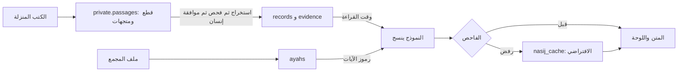

<div dir="rtl">

# شكل السجل وجداول قاعدة البيانات (اقتراح، م-003)

> **الوسم:** كل ما في هذا الملف اقتراح (ج)، إلا ما وُسم (أ) إحالةً إلى صف في [سجل القرارات](../decisions.md). وقيم الكوثر في القسم 5 منقولة من [`kawthar-output.md`](../05-examples/kawthar-output.md)، وحقائق ذلك الملف (ب) فيه.
>
> **كلمتان يجب التفريق بينهما:** «**المقطع**» جزء من السورة، وجدوله `segments`. و«**القطعة**» جزء من نص كتاب نزّلناه، وجدولها `passages`.
>
> كتبه ممر `think` في 4 أكتوبر 2026. قراءة فقط، ولم يُعدَّل أي ملف.

---

## 0. الفكرة في سطور (ج)

- **وحدة السجل هي مدخل اللوحة.** ففي مثال الكوثر عشرون مدخلًا فيها 41 دليلًا، ولكل علامة في المتن مدخل واحد. فالتصميم جدولان: `records`، والسجل فيه هو الدعوى والعلامة ومدخل اللوحة معًا. و`evidence`، والصف فيه دليل واحد بأيقونة نوعه.
- **القراءة لا تحتاج متجهات.** جزء عمّ يُقرأ بمفتاح الآية: نجلب سجلات آيات المقطع، ثم ننسج منها. والمتجهات لعملين اثنين: بناء السجلات من الكتب التي لا ترتيب لها بالآيات (الحديث، والسيرة، و«بينات»)، والبحث عن جواب لسؤال يكتبه القارئ بنفسه.
- **لا يرى النموذج نص الكتب وقت القراءة.** يرى السجلات المتحقق منها وحدها، ويكتب رمزًا مكان الآية لا نصها. ونص الآية يضعه العرض من ملف المجمع.
- **سبعة جداول تكفي النسخة الأولى:** `ayahs`، و`sources`، و`segments`، و`records`، و`evidence`، و`nasij_cache`، و`private.passages`. وتفضيلات الجلسة تبقى في المتصفح حتى يُحسم ق-057.
- **«سوبابيز» نفسه لم يُحسم.** ق-125 (أ) يحسم Next.js وحده، والتخزين في ملف المهمة «لم تُحسم». والجداول هنا Postgres عادية فيها pgvector، فتصلح لـ«سوبابيز» ولغيره.

---

## 1. طبقات البيانات (ج)

| الطبقة | ما هي | من أين | أين تُخزَّن | تُستعمل في | هل ينسج منها النموذج؟ |
|---|---|---|---|---|---|
| **أ. نص الآية** | 6236 آية بالرسم العثماني والإملائي | `hafsData_v2-0.json` (أ، ق-038) | `ayahs`، عامة | العرض، ومطابقة آية يذكرها القارئ، وفحص الآيات | **بالرمز وحده:** يكتب `[[ayah:108:3]]`، والعرض يضع النص من الملف |
| **ب. فهرس المصادر** | الكتاب، والطبعة، والمنصة، والشروط، ونتيجة اختبار ق-055 | [`sciences-and-books.md`](../03-knowledge-sources/sciences-and-books.md) و[`source-register.md`](../03-knowledge-sources/source-register.md) | `sources`، عامة | يعرض العزو في اللوحة، ويحكم به الفاحص | **لا.** يظهر في اللوحة من السجل |
| **ج. نص الكتب المنزَّلة** | نصوص الكتب مقطّعة، ولكل قطعة متجه | الشاملة، وسورة بيديا، وموسوعتا القرآن والأحاديث، و«بينات» (أ، ق-056، ق-129) | `private.passages`، **خاصة** (أ، ق-131) | بناء السجلات، والتحقق من أن الاقتباس موجود في الكتاب بلفظه، والبحث | **أبدًا.** للبحث والدليل فقط |
| **د. السجلات المتحقق منها** | الدعوى، وأدلتها بأيقوناتها، والرواية بحكمها وحاكمها، ومعنى اللفظ، والرابط بتقدير قوته، والنبذة، وجواب الشبهة، والإشكال، والهداية | تُستخرج من (ج)، ثم تُفحص، ثم يوافق عليها إنسان | `records` و`evidence` | النسج، واللوحة، والشارات | **نعم، وحدها،** وبشرط أن تكون حالتها `verified` أو أعلى، ودرجتها الدنيا لا تزيد على الدرجة التي اختارها القارئ (أ، ق-048) |
| **هـ. النسيج الافتراضي** | نسيج مجهَّز لكل مقطع ودرجة وأسلوب | النموذج، بعد أن يقبله الفاحص | `nasij_cache` | العرض الفوري، والبديل حين يتوقف النموذج (أ، ق-051) | **لا.** يُعرض كما هو، ولا يُستعمل مدخلًا لنسج آخر |
| **و. تفضيلات الجلسة** | الدرجة والأسلوب اللذان اختارهما القارئ، وتقييمه الظاهر، وإذنه | القارئ نفسه (أ، ق-050، ق-057) | المتصفح في النسخة الأولى | تضبط الأسلوب والعمق والترتيب | **لا محتوى منها.** تُمرَّر إلى النموذج إعدادات فقط، ولا يُستنتج منها شيء عن القارئ (أ، ق-018) |



**الخلاصة:** ينسج النموذج من (د) وحدها، ويشير إلى (أ) برموز. أما (ب) فللعرض والفحص. و(ج) للبحث والدليل فقط. و(هـ) للعرض والبديل. و(و) إعدادات لا محتوى.

---

## 2. حقول السجلات (ج)

في عمود «يطلبه»: الصف المذكور مع (أ) قرار يفرض الحقل. و(ج) وحدها تعني أن الحقل نحتاجه للبناء أو للفحص، ولا قرار يفرضه.

### 2.1 الحقول المشتركة لكل سجل (`records`)

| الحقل | النوع | لازم؟ | يطلبه |
|---|---|---|---|
| `id` | text، مثل `108-r06` | نعم | كل فقرة تحمل رقم سجلها (أ، ق-048) |
| `kind` | `claim` أو `word_meaning` أو `link` أو `term_note` أو `ishkal` أو `shubha` أو `hidaya` | نعم | السجلات التي يعددها ق-048 (أ)، والنبذة في ق-040 (أ)، والشبهة في ق-027 (أ) |
| `topic` | `nuzul` أو `makki_madani` أو `sira` أو `maqsad` أو فارغ | لا | للفرز وحده (ج) |
| `sura_no`، `ayah_keys` | smallint، وtext[] | نعم (يجوز أن تكون فارغة في الشبهة العامة والنبذة) | ق-038، ق-103 (أ) |
| `claim` | text: الدعوى في جملة واحدة، بصياغتنا | نعم | «الدعوى بمصدرها ودرجتها» (أ، ق-048) |
| `badge` | `thabit` أو `la_yathbut` أو `khilaf_mutabar` أو فارغ (لم نحكم) | لا | شارات الثبوت (أ، ق-024) |
| `buildable` | boolean: هل يُبنى عليه المعنى؟ | نعم | (أ، ق-032، ق-059) |
| `depth_min` | من 0 إلى 3 | نعم | الدرجات (أ، ق-026). والأثر بلا حكم في الدرجة 3 وحدها (أ، ق-059) |
| `khilaf_group`، `khilaf_changes_core` | text، وboolean | عند الخلاف | شارة الخلاف (أ، ق-024). و«الخلاف الذي لا يغيّر أصل المعنى في التعمق وحده» قاعدة (ج) من [`nasij-reader-layer`](../02-method/nasij-reader-layer.md). وسياسة الخلاف مفتوحة (ق-113) |
| `built_on` | text[]: أرقام سجلات | لازم في الهداية والإشكال | ما لا يثبت لا يُبنى عليه (أ، ق-032) |
| `panel_note` | text | لا | «الملاحظات» في اللوحة (أ، ق-024) |
| `review_status` | `candidate` أو `verified` أو `specialist_reviewed` | نعم | مراجعة المتخصص من ضوابط ق-013 (أ). والمراجع نفسه مفتوح (ق-105) |
| `embedding` | vector | لا | لأسئلة القارئ (ج) |

### 2.2 حقول خاصة ببعض الأنواع

| النوع | الحقول الزائدة | يطلبه |
|---|---|---|
| `claim` | لا شيء | — |
| `word_meaning` | `lemma` (اللفظ كما في الآية)، لازم | «معاني الكلمات» (أ، ق-048) |
| `link` | الحقول في أدلته (2.5) | (أ، ق-025). وحقوله مفتوحة في ق-114، وهذا اقتراح له |
| `term_note` | `term`، لازم. و`plain_meaning` (المعنى بكلمات بسيطة)، لازم. ودليل واحد على الأقل | يأتي الاسم بعد المعنى البسيط (أ، ق-040). ومصدر النبذة مفتوح (ف-029) |
| `ishkal` | `question`، لازم. والجواب هو `claim`. و`built_on`، لازم | فكرة استباق الإشكال. وضابطه الخامس (لا يُعرض إلا بجواب راجعه متخصص) (ج) |
| `shubha` | `question`، و`question_variants[]`، و`short_answer`، و`return_segment_id`، كلها لازمة | مسار جانبي يعود إلى الرحلة (أ، ق-027). و«بينات» أولًا (أ، ق-039). وفي «بينات» حقل «مختصر الإجابة» (ب، source-register) |
| `hidaya` | `built_on`، لازم، ولا يشير إلا إلى سجلات `buildable`. و`depth_min` لا يقل عن 2 | (أ، ق-032)، والدرجة 2 من [`nasij-reader-layer`](../02-method/nasij-reader-layer.md) (ج) |

### 2.3 حقول الدليل (`evidence`)، وهي لكل دليل

| الحقل | النوع | لازم؟ | يطلبه |
|---|---|---|---|
| `id` | text، مثل `108-r06-e2` | نعم | (أ، ق-048) |
| `record_id`، `ord` | مفتاح السجل، وترتيب الدليل في المدخل | نعم | العلامة الواحدة قد تجمع أكثر من دليل (أ، ق-024) |
| `icon` | `ayah` أو `hadith` أو `athar` أو `scholar` أو `ijtihad_link` أو `hidaya` | نعم | الأيقونات الست (أ، ق-024) |
| `source_id` | مفتاح في `sources` | لازم، إلا في الآية والهداية | المصدر بالكتاب (أ، ق-024) |
| `ayah_keys` | text[] | لازم في الآية وحدها، **ولا يُخزَّن نصها هنا** | (أ، ق-038) |
| `locator` | text: «30/576»، أو «ح400، 1/300»، أو «عند الآية 3» | لازم مع المصدر | الكتاب والجزء والصفحة (أ، ق-024، ق-131) |
| `page_url` | text | لازم مع المصدر | رابط الصفحة (أ، ق-131) |
| `sayer` | text: القائل | لازم في `scholar` و`athar` و`ijtihad_link` | مصدر لكل دعوى (أ، ق-013). والشرّاح الأربعة ليسوا قائلين (أ، ق-061) |
| `transmitted_via` | text، مثل «نقله ابن كثير» | لا | من المدخل 8 في الكوثر (ج) |
| `quote` | text، لا يتجاوز حدًّا (القسم 4) | لازم، إلا في الآية والهداية | اقتباس قصير منسوب (أ، ق-131) |
| `passage_id` | رقم القطعة في `private.passages` | لازم مع الاقتباس | ليتحقق الفاحص أن الاقتباس في الكتاب بلفظه (ج) |
| `verified_at_source` | boolean: هل فتحنا صفحة الكتاب الأصلي نفسها؟ | نعم | الكتب الأصلية بدل الدرر (أ، ق-128، ق-129) |
| `status_text` | text: الحالة كما تظهر في اللوحة | نعم | «الحكم أو الحالة» (أ، ق-024) |
| `note` | text | لا | (أ، ق-024) |

### 2.4 حقول زائدة في الرواية (حين تكون الأيقونة `hadith` أو `athar`)

| الحقل | النوع | لازم؟ | يطلبه |
|---|---|---|---|
| `narration_kind` | `marfu` أو `athar` أو `sira_report` | نعم | (أ، ق-058) |
| `isnad_note` | text | لا. يظهر في اللوحة وحدها | لا أسانيد في المتن (أ، ق-024) |
| `grading_text` | text بلفظ الحاكم | **نعم** | (أ، ق-058) |
| `grading_verdict` | `sahih` أو `hasan` أو `daif` أو `daif_jiddan` أو `mawdu` | نعم | للفاحص ولاختيار الشارة (ج) |
| `grader_name` | text: **عالم مسمى** | **نعم** | (أ، ق-058) |
| `grading_source_id`، `grading_locator` | موضع الحكم في كتابه | نعم | (أ، ق-055، ق-058) |

**الاستثناء الوحيد:** يجوز أن تبقى حقول الحكم فارغة إذا اجتمعت أربعة شروط: أن تكون الرواية أثرًا (`athar`)، وأن تكون الدرجة الدنيا للسجل 3، وأن يكون `buildable = false`، وأن تحمل `status_text` عبارة «لم نحكم على ثبوته» مع القائل والمصدر (أ، ق-059). أما الحديث المرفوع بلا حكم فلا يُستعمل أصلًا (أ، ق-058).

### 2.5 قول العالم والرابط الاجتهادي، وحقل «ما يسنده خارج القائل»

| الحقل | النوع | لازم؟ | يطلبه |
|---|---|---|---|
| `link_strength` | `strong` أو `medium` أو `weak` أو `not_assessed` | لازم في `ijtihad_link`، **وممنوع في غيره** | التقدير كلمات، في اللوحة، لروابط الاجتهاد وحدها (أ، ق-025) |
| `link_from`، `link_to` | text[]: مفاتيح آيات أو أرقام سجلات | لازم في `ijtihad_link` | ق-114 مفتوح (ج) |
| `outside_support` | jsonb: قائمة عناصر، في كل عنصر `ref` (رقم دليل أو سجل)، و`relation` (`supports` أو `contradicts`)، و`note` | لازم في `ijtihad_link` إذا كان التقدير «قوية» أو «متوسطة»، واختياري في `scholar` | (ج)، ويدخل في ق-114 |

**ما يسنده خارج القائل (ج):** دليل لا يرجع إلى العالم الذي قال القول، يقوّي القول أو يضعفه. قد يكون قول عالم آخر يوافقه، أو معنى لفظ ثابتًا، أو لفظ الآية نفسه. وكل `ref` يشير إلى دليل موجود فعلًا في البيانات، فلا يُكتب سند من الذاكرة. ومن الكوثر:
- المدخل 13: «يسنده معنى «لربك» عند ابن عاشور والطبري (8)»، فالعنصر `supports` يشير إلى `108-r08`.
- المدخل 14: «والبقاعي يقابل المنع بـ«أعطيناك» لا بـ«وانحر»»، فالعنصر `contradicts`.

ويترتب على ذلك أن التقدير «قوية» لا يُقبل إلا مع سند من معنى لفظ أو تفسيره، لأن تعريفه «ويسنده تفسير الألفاظ» (أ، ق-025). والجملة الثابتة «نقدّر الصلة هنا؛ ثبوت القول عن العالم مبيّن بصورة مستقلة.» يكتبها العرض، ولا تُخزَّن.

### 2.6 حقول المصدر (`sources`)

| الحقل | النوع | لازم؟ | يطلبه |
|---|---|---|---|
| `id`، `register_code` | text، ورقم «ك-…» في الحصر | نعم | (ج) |
| `title`، `author`، `author_death`، `edition` | text (والطبعة: الناشر، والسنة، والمحقق) | نعم، إلا الوفاة | الكتاب في اللوحة (أ، ق-024) |
| `platform`، `platform_book_id`، `url_template` | text | نعم | الوصول من منصات لها وصول فعلي (أ، ق-128). ورابط الصفحة (أ، ق-131) |
| `genre` | `quran_text` أو `hadith` أو `takhrij_rijal` أو `tafsir_mathur` أو `tafsir` أو `tafsir_summary` أو `language` أو `balagha` أو `grammar` أو `terms` أو `ulum_quran` أو `sira` أو `shubuhat` | نعم | لا رواية من كتب اللغة والبلاغة والقواعد والمصطلحات (أ، ق-060). والمعنى الإجمالي من التفاسير المختصرة (أ، ق-129) |
| `q055_status` | `meets` أو `partial` أو `fails` أو `unconfirmed` أو `outside_test` (النتائج الخمس في الحصر، القسم 1.1) | نعم | (أ، ق-055، ق-058، ق-060) |
| `reuse_policy` | `internal_only` أو `redistribute_with_conditions`، والأول هو الأصل | نعم | (أ، ق-131) |
| `terms_quote` | text: الشروط بلفظها | لا | فحص الحقوق (أ، ق-013) |
| `approved_for_use` | boolean | نعم | المجموعة معتمدة للعمل (أ، ق-062) |

### 2.7 النسيج الافتراضي والجلسة

- **`nasij_cache`:** المفتاح المقطع والدرجة والأسلوب (أ، ق-051). وفيه `paragraphs`، وهي فقرات بالرموز ومع كل فقرة أرقام سجلاتها. ومعها `records_hash`، فإن تغيّر سجل بطل المخزَّن وأُعيد نسجه. و`checker_passed`. و`model`.
- **الجلسة:** الدرجة التي اختارها القارئ، والأسلوب الذي طلبه، وتقييماته الظاهرة (أ، ق-050). والإذن بتعلم السلوك وتاريخه (أ، ق-057). وفي النسخة الأولى تبقى في المتصفح. وجدول `reader_prefs` لا يُنشأ إلا لمن أذن بالحفظ عبر الجلسات (أ، ق-050)، ومعه المسح. **ولا عمود فيه لسمة دينية أو شخصية** (أ، ق-018)، ولا لنص أسئلة القارئ إلا بإذنه (حالة huda-12).

---

## 3. جداول Postgres (ج)

```sql
create extension if not exists vector;
create extension if not exists pg_trgm;
create schema if not exists private;   -- لا يُضاف إلى المخططات المكشوفة في الواجهة

-- (أ) نص الآية: كل المصحف (6236 آية)، ويُعرض منه أي نص (حالة huda-05)
create table ayahs (
  ayah_key        text primary key,          -- '108:3'
  sura_no         smallint not null,
  aya_no          smallint not null,
  jozz            smallint not null,
  page            smallint not null,
  sura_name_ar    text not null,
  aya_text        text not null,             -- عثماني، من hafsData_v2-0.json
  aya_text_emlaey text not null,             -- إملائي، من الملف نفسه
  emlaey_norm     text not null,             -- بعد التطبيع وتصحيح ق-133 للمطابقة فقط
  unique (sura_no, aya_no)
);
create index ayahs_trgm on ayahs using gin (emlaey_norm gin_trgm_ops);

-- (ب) المصادر
create table sources (
  id text primary key, register_code text,
  title text not null, author text not null, author_death text, edition text,
  platform text not null, platform_book_id text, url_template text,
  genre text not null, q055_status text not null,
  reuse_policy text not null default 'internal_only',
  terms_quote text, approved_for_use boolean not null default false
);

-- المقاطع: المقطع هو السورة كلها في القصار
create table segments (
  id text primary key,                        -- '108-all'
  sura_no smallint not null, ayah_from smallint not null, ayah_to smallint not null,
  title text
);

-- (د) السجلات
create table records (
  id text primary key, kind text not null, topic text,
  sura_no smallint, ayah_keys text[] not null default '{}',
  claim text not null, badge text, buildable boolean not null,
  depth_min smallint not null check (depth_min between 0 and 3),
  khilaf_group text, khilaf_changes_core boolean, built_on text[],
  lemma text, term text, plain_meaning text,
  question text, question_variants text[], short_answer text, return_segment_id text,
  panel_note text, review_status text not null default 'candidate',
  embedding vector(1024), updated_at timestamptz not null default now()
);
create index records_ayahs on records using gin (ayah_keys);
create index records_vec on records using hnsw (embedding vector_cosine_ops);

create table evidence (
  id text primary key,
  record_id text not null references records(id) on delete cascade,
  ord smallint not null, icon text not null,
  source_id text references sources(id), ayah_keys text[],
  locator text, page_url text, sayer text, transmitted_via text,
  quote text, passage_id bigint,              -- references private.passages(id)
  verified_at_source boolean not null default false, status_text text not null,
  narration_kind text, isnad_note text,
  grading_text text, grading_verdict text, grader_name text,
  grading_source_id text references sources(id), grading_locator text,
  link_strength text, link_from text[], link_to text[], outside_support jsonb,
  note text
);

-- (هـ) النسيج الافتراضي
create table nasij_cache (
  segment_id text references segments(id),
  depth smallint check (depth between 0 and 3),
  style text not null default 'default',
  paragraphs jsonb not null, records_hash text not null,
  checker_passed boolean not null, model text,
  created_at timestamptz not null default now(),
  primary key (segment_id, depth, style)
);

-- (ج) نص الكتب: خاص (ق-131)
create table private.passages (
  id bigserial primary key,
  source_id text not null references public.sources(id),
  volume text, page text, page_url text, heading text,
  ayah_keys text[],                           -- إن كان الكتاب مرتبًا بالآيات
  chunk_no int not null, text text not null, text_norm text not null,
  embedding vector(1024)
);
create index passages_ayahs on private.passages using gin (ayah_keys);
create index passages_vec on private.passages using hnsw (embedding vector_cosine_ops);
```

- **عدد الأبعاد (1024)** مأخوذ من تقدير الحصر (القسم 6). ونموذج المتجهات لم يُختر.
- **الحجم:** مجموعة جزء عمّ نحو 15 إلى 25 ألف قطعة (تقدير الحصر، القسم 6، ج)، أي نحو 100 م.ب للمتجهات. ويمكن تخزينها بنصف الدقة (`halfvec`) لتصغيرها.
- **الأنواع:** كتبتُ الأعمدة المحدودة القيم `text` للاختصار. وتُضاف إليها قيود `check` بالقيم المذكورة في القسم 2.

### كيف يجري الاسترجاع

| ماذا | بمفتاح الآية | بالبحث الدلالي (pgvector) | بالتشابه النصي (trigram) |
|---|---|---|---|
| قراءة مقطع | `records` و`evidence` و`nasij_cache` | — | — |
| بناء السجلات من التفاسير المرتبة بالآيات | `passages.ayah_keys` | للتوسعة | — |
| بناء السجلات من الحديث والسيرة و«بينات» | — | `passages.embedding` | — |
| سؤال يكتبه القارئ | سجلات الآية إن ذكر آية | `records.embedding`، وفيه نص الدعوى وصيغ السؤال في الشبهة | لكشف الآية التي يذكرها في `ayahs` (حالات rasmi-11 وhuda-01 وhuda-02) |
| التحقق من الاقتباس | — | — | `passages.text_norm` |

وفي سؤال القارئ يجوز البحث في القطع أيضًا، لكن القطعة لا تصير جوابًا. تُتبع إلى السجلات التي تشير إليها، ومنها يأتي الجواب. فإن لم يشر إليها سجل متحقق منه، امتنع النظام (أ، ق-014)، بعبارة نقص المصادر (مفتوحة في ق-127).

### ما لا يخرج من القاعدة الخاصة (أ، ق-131)

- **`private.passages` كلها:** النص، والنص المطبَّع، والمتجهات. وتبقى خاصة أيًّا كان مصدرها، حتى يُحسم هل يُعد تقطيع نص موسوعتي القرآن والأحاديث «تعديلًا» يمنعه شرطهما الأول (الحصر، القسم 5، البند 7) (ج).
- **الملفات المنزَّلة نفسها:** قاعدة الشاملة، وقواعد سورة بيديا، وملفات PDF. تبقى على القرص خارج المستودع، ويُحمى مجلدها بـ`.gitignore`، ومعها أي نسخة احتياطية من القاعدة.
- **مخطط `private`** لا يُكشف في واجهة القاعدة. والقراءة كلها من خادم Next.js بمفتاح الخادم، بلا صلاحيات للزائر المجهول.
- **طلب النسج وقت القراءة** لا يحمل نص القطع. يحمل السجلات وحدها، والاقتباس فيها قصير، وهو ما يراه القارئ أصلًا.
- **العام:** `ayahs`، و`sources`، و`segments`، و`records`، و`evidence` (والاقتباس فيه قصير)، و`nasij_cache`.

---

## 4. الفحوص الآلية (ج)

### 4.1 فحص البيانات، قبل أن يصير السجل `verified`

| # | الفحص | السند |
|---|---|---|
| S1 | كل مفتاح آية في `records` و`evidence` و`segments` موجود في `ayahs`. ولا تُعلن تغطية آية إلا إذا كان كل سجل في مقطعها `verified`، وفيه نسيج افتراضي مقبول | (أ، ق-038، ق-103) |
| S2 | كل نص بين ﴿ ﴾ في `claim` أو `short_answer` جزء متصل من النص الإملائي المطبَّع لآية في `ayah_keys` | (أ، ق-038، ق-048) |
| S3 | دليل الآية لا اقتباس فيه، ونصها يُجلب من `ayahs` | (أ، ق-038) |
| S4 | لكل سجل دليل واحد على الأقل. والهداية دليلها أيقونة `hidaya` بلا مصدر، ومعها `built_on` غير فارغ | (أ، ق-013، ق-048) |
| S5 | كل دليل له مصدر فيه `locator` و`page_url`، ومصدره `approved_for_use` | (أ، ق-024، ق-131، ق-062) |
| S6 | كل رواية (`hadith` أو `athar`) فيها `grading_text` و`grader_name` و`grading_source_id` و`grading_locator`. إلا استثناء الأثر في 2.4. والحديث المرفوع بلا حكم مرفوض | (أ، ق-058، ق-059) |
| S7 | لا رواية مصدرها من نوع `language` أو `balagha` أو `grammar` أو `terms` | (أ، ق-060) |
| S8 | الرواية من مصدر نتيجته `fails` أو `partial` أو `unconfirmed` حكمها من غير ذلك المصدر (`grading_source_id ≠ source_id`). وما نتيجته `meets` يجوز أن يكون هو الحاكم | (أ، ق-055، ق-058) |
| S9 | الاتساق: «لا يثبت» يلزمه `buildable = false`. والأثر بلا حكم يلزمه الدرجة 3 و`buildable = false` وعبارة «لم نحكم على ثبوته». وكل سجل في `khilaf_group` شارته «خلاف معتبر». والخلاف الذي لا يغيّر أصل المعنى درجته 3 | (أ، ق-024، ق-032، ق-059)، والأخير (ج) |
| S10 | `link_strength` موجود في كل `ijtihad_link` وحده. وما سوى «لم نقيّم» معه `outside_support`. و«قوية» لا تكون إلا مع سند من معنى لفظ أو تفسيره. وكل `ref` موجود | (أ، ق-025)، وق-114 مفتوح |
| S11 | `built_on` في الهداية والإشكال لا يشير إلا إلى سجلات `buildable`. والهداية درجتها الدنيا 2 | (أ، ق-032) |
| S12 | الاقتباس لا يتجاوز **400 حرف** (الرقم مقترح)، وموجود بلفظه في القطعة `passage_id` بعد التطبيع | (أ، ق-131) |
| S13 | `verified_at_source = true` في كل دليل. فما أُخذ عبر الدرر يُعاد فتحه من الكتاب الأصلي | (أ، ق-128، ق-129) |
| S14 | `sayer` ليس أحد الشرّاح الأربعة | (أ، ق-061) |
| S15 | كل دليل حالته غير «ثابت» أو بلا شارة، تقول `status_text` ذلك صراحة | لا يُوهم الثبوت (أ، ق-032)، والمفتاح في الكوثر |

### 4.2 فحص كل فقرة وقت القراءة

صيغة الإخراج المقترحة: يكتب النموذج نصًّا فيه رموز، مثل `[[r:108-r03]]` للعلامة، و`[[ayah:108:3]]` للآية، و`[[term:…]]` للنبذة، و`[[ex]]…[[/ex]]` للمثال اليومي.

| # | الفحص | السند |
|---|---|---|
| R1 | في كل فقرة رمز سجل واحد على الأقل. وكل سجل مذكور موجود، وحالته `verified` أو أعلى، ومن آيات المقطع أو من سجل مذكور معه، ودرجته الدنيا لا تزيد على الدرجة المطلوبة | (أ، ق-048، ق-026) |
| R2 | رمز الآية لا يشير إلا إلى آية من `ayah_keys` في سجلات الفقرة أو من آيات المقطع. **ولا نص ﴿…﴾ يكتبه النموذج،** إلا جزءًا متصلًا من الإملائي يطابق آية من تلك الآيات، ويُعرض حينئذ من حقل المجمع الإملائي | (أ، ق-038، ق-048، ق-014) |
| R3 | لا جملة في الفقرة تشبه آية بلا رمز (تشابه نصي فوق حد يُضبط بالتجربة). وهذا يمنع آية مكتوبة من الحفظ، أو كلامًا يُعرض على أنه آية (حالتا huda-08 وhuda-10) | (أ، ق-014، ق-048) |
| R4 | كل نص بين «» أطول من خمس كلمات جزء من اقتباس دليل في سجلات الفقرة. فلا يكتب النموذج نص حديث أو قول من عنده | (أ، ق-014، ق-048) |
| R5 | المتن خالٍ من أسماء الرواة والحاكمين، ومن كلمات الإسناد مثل «رواه» و«أخرجه» و«إسناده». وتُبنى القائمة من `sources` و`sayer` و`grader_name`. وأسماء يحتاجها المعنى نفسه، كالعاص في التعمق، تُستثنى في السجل | (أ، ق-024) |
| R6 | فقرة لا تقوم إلا على سجلات `buildable = false` لا تكون إلا في الدرجة 3. والشارة يرسمها العرض من السجل، لا النموذج | (أ، ق-032، ق-059) |
| R7 | كل رمز نبذة يشير إلى سجل `term_note` موجود | (أ، ق-040) |
| R8 | إن رُفضت فقرة، يُعرض النسيج الافتراضي للمقطع والدرجة. وهذا غير محسوم (ق-135) | ق-051 (أ) يغطي توقف النموذج وحده |

### 4.3 ما لا يستطيعه الفاحص

- لا يعرف هل الجملة المصاغة وفية لمعنى السجل. وهذا لمراجعة الإنسان للنسيج الافتراضي، أو لمقيّم آلي لاحقًا (ف-031).
- لا يعرف هل في جملة بلا علامة معلومة جديدة. وهل يرفض الفاحص كل معلومة بلا سجل سؤال مفتوح في ق-135.

---

## 5. مثال الكوثر: أربعة سجلات (ج)

القيم كلها منقولة من [`kawthar-output.md`](../05-examples/kawthar-output.md). وما أضفتُه علامة ⚠ أمامه، وهو تمثيل لما في المثال أو نقص فيه، لا حكم جديد.

### 5.1 `108-r03`: سجل `claim` في الدرجة 0

```json
{
  "id": "108-r03", "kind": "claim", "sura_no": 108, "ayah_keys": ["108:1", "108:3"],
  "claim": "«شانئك»: من يكرهك. ومن يكرهك هو الأبتر، لا أنت، و«الأبتر» في آخر السورة يقابل «الكوثر» في أولها",
  "badge": "thabit", "buildable": true, "depth_min": 0, "review_status": "verified",
  "evidence": [
    { "id": "108-r03-e1", "icon": "scholar", "source_id": "ibn-kathir-tafsir", "sayer": "ابن كثير",
      "locator": "عند الآية 3", "page_url": "https://tafsir.app/ibn-katheer/108/1",
      "quote": "أي: إن مبغضك -يا محمد- ومبغض ما جئت به من الهدى والحق والبرهان الساطع والنور المبين، هو الأبتر الأقل الأذل المنقطع ذكره",
      "status_text": "ثابت", "verified_at_source": true },
    { "id": "108-r03-e2", "icon": "scholar", "source_id": "ibn-ashur-tahrir", "sayer": "ابن عاشور",
      "locator": "30/576",
      "quote": "لأن ضمير الفصل يفيد قصر صفة الأبتر على الموصوف… وهو قصر قلب، أي: هو الأبتر لا أنت",
      "status_text": "ثابت" },
    { "id": "108-r03-e3", "icon": "scholar", "source_id": "ibn-ashur-tahrir", "sayer": "ابن عاشور",
      "locator": "30/573", "quote": "فقوبل معنى الأبتر بمعنى الكوثر، إبطالا لقولهم", "status_text": "ثابت" }
  ]
}
```

⚠ `page_url` منقول من المثال (tafsir.app). وعند الإدخال يكون رابط صفحة الكتاب في المنصة التي نزّلناه منها (أ، ق-129)، ومعه `passage_id`.

### 5.2 `108-r06`: حديث وأثر وقول عالم في مدخل واحد

```json
{
  "id": "108-r06", "kind": "claim", "sura_no": 108, "ayah_keys": ["108:1"],
  "claim": "الكوثر: الخير الكثير جدًّا، ومنه نهر وعده الله نبيه، والنهر جزء منه",
  "badge": "thabit", "buildable": true, "depth_min": 1, "review_status": "verified",
  "evidence": [
    { "id": "108-r06-e1", "icon": "scholar", "source_id": "ibn-ashur-tahrir", "sayer": "ابن عاشور",
      "locator": "30/572", "quote": "والكوثر: اسم في اللغة للخير الكثير صيغ على زنة فوعل", "status_text": "ثابت" },
    { "id": "108-r06-e2", "icon": "hadith", "narration_kind": "marfu", "source_id": "sahih-muslim",
      "locator": "كتاب الصلاة، ح400، 1/300", "page_url": "https://www.islamweb.net/ar/library/content/1/678/",
      "quote": "فإنه نهر وعدنيه ربي عز وجل، عليه خير كثير، هو حوض ترد عليه أمتي يوم القيامة",
      "grading_text": "صحيح، في صحيح مسلم من حديث أنس رضي الله عنه", "grading_verdict": "sahih",
      "grader_name": "⚠ مسلم (بإخراجه في صحيحه)", "grading_source_id": "sahih-muslim", "grading_locator": "ح400",
      "status_text": "ثابت: صحيح، في صحيح مسلم من حديث أنس رضي الله عنه" },
    { "id": "108-r06-e3", "icon": "athar", "narration_kind": "athar", "source_id": "sahih-bukhari",
      "sayer": "ابن عباس، وسعيد بن جبير", "locator": "كتاب الرقاق، باب في الحوض، ح6578",
      "page_url": "https://sunnah.com/bukhari:6578",
      "quote": "الكوثر الخير الكثير الذي أعطاه الله إياه. قال أبو بشر: قلت لسعيد: إن أناسا يزعمون أنه نهر في الجنة. فقال سعيد: النهر الذي في الجنة من الخير الذي أعطاه الله إياه",
      "grading_text": "صحيح الإسناد، في صحيح البخاري", "grading_verdict": "sahih",
      "grader_name": "⚠ البخاري (بإخراجه في صحيحه)",
      "status_text": "ثابت: صحيح الإسناد، في صحيح البخاري" },
    { "id": "108-r06-e4", "icon": "scholar", "source_id": "fath-al-bari", "sayer": "ابن حجر",
      "locator": "كتاب التفسير، سورة الكوثر، 8/604",
      "quote": "هذا تأويل من سعيد بن جبير جمع به بين حديثي عائشة وابن عباس", "status_text": "ثابت" }
  ]
}
```

⚠ هل يُعد إخراج الحديث في الصحيحين «حكمًا من عالم مسمى» بمعنى ق-058؟ في المثال «في صحيح مسلم» فقط، والجواب للمتخصص (القسم 6).

### 5.3 `108-r11`: رابط اجتهادي بتقدير قوته وما يسنده

```json
{
  "id": "108-r11", "kind": "link", "sura_no": 108, "ayah_keys": ["107:2", "107:3", "108:1"],
  "claim": "﴿يدع اليتيم﴾: يقهر الطفل الذي مات أبوه ويظلمه، ولا يشجّع على إطعام من لا يجد ما يكفيه. ويقابله ﴿إنا أعطيناك الكوثر﴾",
  "badge": "thabit", "buildable": true, "depth_min": 2, "review_status": "verified",
  "evidence": [
    { "id": "108-r11-e1", "icon": "scholar", "source_id": "ibn-kathir-tafsir", "sayer": "ابن كثير",
      "locator": "عند الماعون: 2–3", "page_url": "https://tafsir.app/ibn-katheer/107/2",
      "quote": "أي: هو الذي يقهر اليتيم ويظلمه حقه، ولا يطعمه ولا يحسن إليه", "status_text": "ثابت" },
    { "id": "108-r11-e2", "icon": "scholar", "source_id": "lisan-al-arab", "sayer": "ابن منظور",
      "locator": "مادة «يتم»",
      "quote": "الليث: اليتيم الذي مات أبوه فهو يتيم حتى يبلغ، فإذا بلغ زال عنه اسم اليتم", "status_text": "ثابت" },
    { "id": "108-r11-e3", "icon": "ijtihad_link", "source_id": "razi-mafatih", "sayer": "الرازي",
      "locator": "32/110",
      "quote": "فذكر في مقابلة البخل قوله: إنا أعطيناك الكوثر، أي إنا أعطيناك الكثير، فأعط أنت الكثير ولا تبخل",
      "status_text": "ثابت (النسبة إلى الرازي)", "link_strength": "medium",
      "link_from": ["107:2", "107:3"], "link_to": ["108:1"],
      "outside_support": [ { "ref": "108-r11-e4", "relation": "supports",
                             "note": "يوافقه البقاعي في مقابلة المنع بالعطاء" } ],
      "note": "الآية تخبر بعطاء الله، أما «فأعط أنت» فاستنباط الرازي. والتقدير تقديرنا (ج)، ويُعرض على المتخصص" },
    { "id": "108-r11-e4", "icon": "scholar", "source_id": "biqai-nazm", "sayer": "البقاعي",
      "locator": "22/287", "quote": "فابتدئت الكوثر بأجود الجود",
      "status_text": "⚠ يُتحقق منه عند الإدخال" }
  ]
}
```

- `lisan-al-arab` نوعه `language`، وهذا جائز لأن الدليل ليس رواية (أ، ق-060).
- قول البقاعي في المثال ملاحظة لا صف دليل. ونقلته هنا صف دليل حتى يشير إليه `outside_support`، فيمكن فحصه.

### 5.4 `108-r18`: رواية «لا تثبت» في التعمق وحده

```json
{
  "id": "108-r18", "kind": "claim", "topic": "nuzul", "sura_no": 108, "ayah_keys": ["108:3"],
  "claim": "العاص بن وائل قال لما مات عبد الله: «لقد انقطع نسله فهو أبتر»",
  "badge": "la_yathbut", "buildable": false, "depth_min": 3, "review_status": "verified",
  "evidence": [
    { "id": "108-r18-e1", "icon": "athar", "narration_kind": "athar", "source_id": "ibn-saad-tabaqat",
      "sayer": "منسوبة إلى ابن عباس", "locator": "3/6 (ط. الخانجي)",
      "page_url": "⚠ رابط الدرر في المثال، ويُستبدل برابط الكتاب نفسه",
      "verified_at_source": false,
      "isnad_note": "أخبرنا هشام بن محمد بن السائب، قال أخبرني أبى عن أبي صالح عن ابن عباس…",
      "grading_text": "في إسناده الكلبي", "grading_verdict": "daif_jiddan",
      "grader_name": "صديق حسن خان", "grading_source_id": "fath-al-bayan", "grading_locator": "15/414",
      "status_text": "لا يثبت بهذا الطريق",
      "note": "الكلبي محمد بن السائب «متهم بالكذب» (ابن حجر، «التقريب»)، و«الناس مجمعون على ترك حديثه» (أبو حاتم)، و«متروك» (الدارقطني)، عن «تهذيب التهذيب» 3/569" }
  ]
}
```

**نتيجة الفاحص:**
- يمر في S6 (الحاكم مسمى)، وS7 (المصدر ليس كتاب لغة)، وS9 («لا يثبت» ولا يُبنى عليه، ودرجته 3).
- **ويُرفض في S13** حتى يُفتح «الطبقات» نفسه، لأن المثال أخذه عبر الدرر (أ، ق-128).

### 5.5 فقرة واحدة، والفاحص عليها

جملة من الدرجة 0 في المثال، بصيغة الرموز:

```text
والرد في آخر السورة: [[ayah:108:3]]، أي: إن من يكرهك هو المقطوع، لا أنت[[r:108-r03]].
```

- **R1:** السجل `108-r03` حالته `verified`، ودرجته الدنيا 0، فيمر.
- **R2:** الآية 108:3 من آيات السجل، ونصها يأتي من المجمع، فتمر.
- **R5:** لا اسم في المتن، فتمر.

وأمثلة لما يُرفض:
- كتب النموذج «﴿فصل لربك واشكر﴾»: لا يطابق أي آية، فيُرفض في R2 (حالة rasmi-11).
- استعمل `[[r:108-r18]]` في الدرجة 1: يُرفض في R1 وR6.

---

## 6. ما يبقى مفتوحًا

**لصاحب الفكرة:**
1. **حقول الرابط (ق-114):** القسم 2.5 اقتراح لها، ومعه حقل «ما يسنده خارج القائل». هل يُعتمد؟
2. **خبر السيرة في الكوثر (المدخل 4):** «مات أبناؤه صغارًا» في الدرجتين 0 و1، ومصدره خبر عن الزبير بن بكار «لم نحكم على إسناده». فإن كان خبر السيرة رواية تحت ق-058 وق-059، لم يجز البناء عليه إلا في التعمق، وهذا يمس المثال المعتمد كما كُتب (أ، ق-022). فهل خبر السيرة الذي ينقله مؤرخ رواية بهذا المعنى؟
3. **ما أُخذ عبر الدرر في المثال** (المداخل 16 و17 و18): يُعاد فتحه من الكتب الأصلية قبل إدخاله (أ، ق-128، ق-129). موافقة على العمل فقط.
4. **عرض النسيج الافتراضي حين يرفض الفاحص، وحدود ما يرفضه (ق-135).**
5. **وسم المثال اليومي (ق-122):** اقترحتُ رمز `[[ex]]` في الإخراج، والشكل في الواجهة مفتوح.
6. **عبارة نقص المصادر، والإفصاح عن الذكاء الاصطناعي (ق-127).**
7. **حد طول الاقتباس:** اقترحتُ 400 حرف. وفي المثال اقتباسات طويلة (المدخلان 12 و14): هل تُقص أم يُرفع الحد؟
8. **ملفات السجلات في المستودع العام:** فيها اقتباسات قصيرة، وهي ما يراه القارئ أصلًا. هل يجوز رفعها؟ أم تبقى السجلات في القاعدة وحدها؟
9. **تفاصيل التتبع بعد الإذن (ق-057، م-004)**، وهل يُنشأ جدول للتفضيلات أصلًا في النسخة الأولى (ق-205 للتأكيد).

**للمتخصص (ق-105):**

10. هل إخراج الحديث في الصحيحين «حكم من عالم مسمى» بمعنى ق-058؟
11. أي شارة لـ«ضعيف» الذي ليس شديد الضعف؟ الشارات ثلاث (أ، ق-024).
12. حكم من نأخذ حين يختلف الحاكمون (الحصر، القسم 5، البند 12؛ ق-113).
13. تقديرات قوة الصلة، ومعيار «يسنده تفسير الألفاظ».
14. هل يُعرض الإشكال والشبهة قبل أن يراجعهما متخصص؟ الضابط الخامس (ج) يمنع ذلك، ولا مراجع بعد.
15. مصادر النبذات (ف-029)، وهل يغيّر الخلاف أصل المعنى في كل موضع (ق-113).

**تقني:**

16. نموذج المتجهات وعدد أبعاده.
17. هل يُعد تقطيع نصوص موسوعتي القرآن والأحاديث «تعديلًا» يمنعه شرطهما؟ وإلى أن يُحسم تبقى خاصة.
18. شروط ملف المجمع لم تُفحص (source-register، 1.6). والملف موجود في المستودع أصلًا.
19. إرسال القطع إلى نموذج الاستخراج وقت البناء: هل هو معالجة داخلية بمعنى ق-131؟ أراه كذلك (ج).

---

## 7. ما يُبنى في الأيام الثلاثة، وما ينتظر (ج)

**يُبنى:**
- **اليوم الأول:** الجداول السبعة. وتحميل `ayahs` من ملف المجمع. و`sources` لمجموعة البداية. وقطع الكتب لسور قليلة، تُجلب بمفتاح الآية. وفحوص S1 إلى S15 سكربتًا يعمل عند كل إدخال.
- **اليوم الثاني:** تحويل مداخل الكوثر العشرين إلى سجلات، والبدء بالمداخل التي تمر في الفحص. ثم خط الاستخراج لبقية السور: النموذج يقترح سجلات بحالة `candidate`، ثم الفاحص، ثم موافقة إنسان. ثم النسيج الافتراضي للدرجات الأربع بالأسلوب الافتراضي.
- **اليوم الثالث:** النسج وقت القراءة بالرموز، وفحوص R1 إلى R8، والرجوع إلى الافتراضي.

**ينتظر:**
- متجهات `records`. فالقراءة تكفيها مفاتيح الآيات، والأسئلة الحرة تبدأ بالتشابه النصي.
- جدول `reader_prefs`.
- جدول مستقل للعلاقات بين السجلات، بدل `built_on` و`outside_support`.
- وسم عائلة المعرفة لكل سجل.
- سجل لمخرجات النسج.
- نسخ مخزنة بأساليب أخرى.
- قاعدة الشاملة كاملة (13.3 غ.ب). يكفي جزء عمّ من كتب بعينها، وطريقة أخذها يجربها `worker-high` الآن.

</div>
