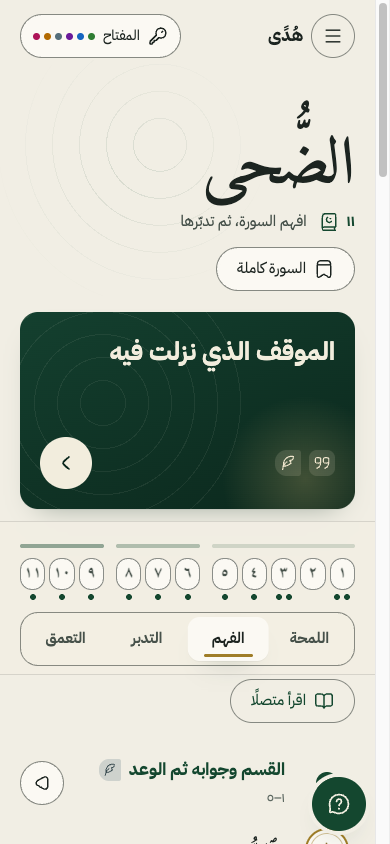
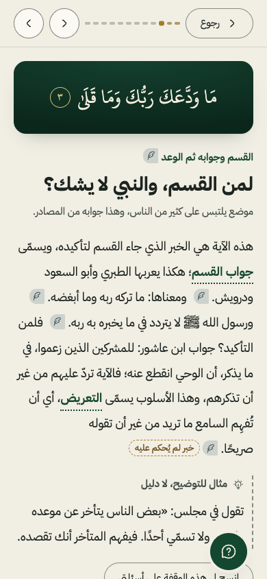
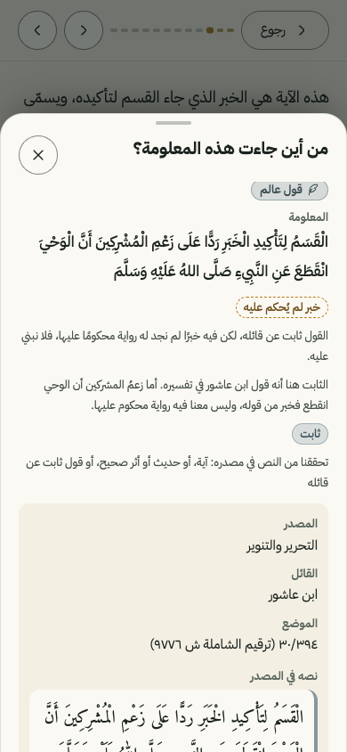
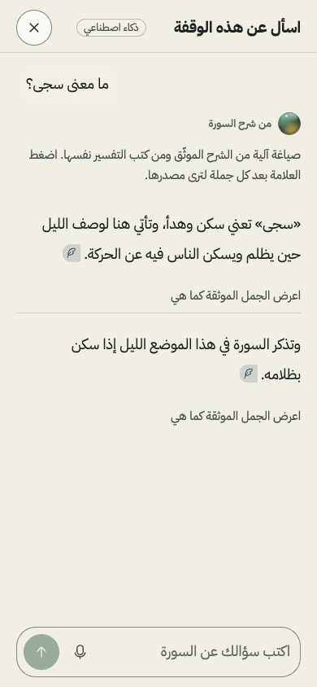
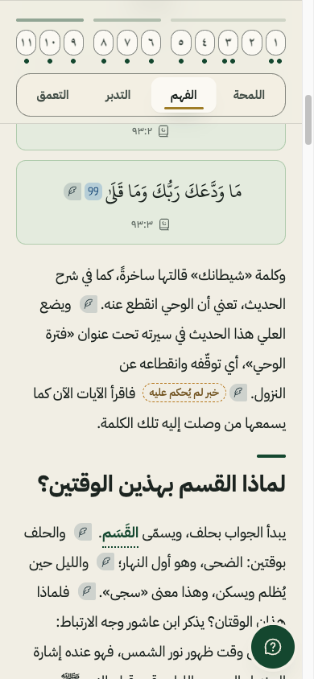

  <header class="hu-cv-id">
    
هُدًى

    
رحلة إلى هدى القرآن

    
ليس مصحفًا آخر ولا مساعد محادثة، بل رحلة بالعربية لقارئ غير متخصص

  </header>
  <section class="hu-cv-flow">
    

      
1<b>يدعو في الفاتحة</b>

      
﴿اهدنا الصراط المستقيم﴾

      
(الفاتحة: 6)

    

    
<Arr />مناسبة ذكرها مفسرون

    

      
2<b>ويقرأ أول البقرة</b>

      
﴿ذلك الكتاب لا ريب فيه هدى للمتقين﴾

      
(البقرة: 2)

    

    
<Arr />

    

      
3

      
فيسأل: كيف آخذ هذا الهدى؟

    

  </section>

  التوفيق بيد الله وحده، وعملنا أن نقرّب بيان كتابه.
  المسار الثالث: التجارب التفاعلية والرحلة المعرفية للتعريف بالإسلام وتعلمه
  تحدي الذكاء الاصطناعي في خدمة المحتوى الإسلامي، مؤسسة باذل الأهلية، 2026
  المناسبة: ابن الزبير الغرناطي، البرهان في تناسب سور القرآن ص190؛ البقاعي، نظم الدرر 1/77

<!--
الزمن في جلسة الخمس دقائق: 15 ثانية.
يُقال: قارئ يدعو في كل ركعة «اهدنا»، ثم يقرأ أول البقرة فيجد الهدى في هذا الكتاب، فيسأل: كيف آخذه؟ هذا السؤال هو المشروع.
لا خانات في هذه الشريحة. نص الآيتين مطابق للحقل الإملائي في ملف مجمع الملك فهد (الفاتحة 6، البقرة 2).
-->

---
layout: default
heading: "الهدى في الكتاب، وما يعين على فهمه متفرق"
sub: "القارئ العربي غير المتخصص يقرأ السورة، وقد يحفظها، ولا يجد طريقًا إلى فهم مترابط يعينه على التدبر."
class: hu-f2
---

<section class="hu-strong">
  
متفرق

  

    

      
التفسير

      
اللغة

      
البلاغة

      
أسباب النزول

    

    
القارئ

    

      
السنة

      
مقاصد السور

      
وغيرها

    

  

  
ما يحتاجه موزع بين علوم كثيرة، وكل علم منها يحتاج دراسة طويلة لا يقدر عليها.

</section>
<section class="hu-steps hu-steps-3">
  

    
1<b>منفصل</b>

    
عرض كل علم تحت عنوان مستقل لا يبيّن كيف تغيّر معلومة من علم فهمَ معلومة من علم آخر.

  

  

    
2<b>طويل</b>

    
دروس التدبر الجذابة طويلة في زمن يقصر فيه الانتباه، ومنها نحو 5 ساعات لسورة الفاتحة وحدها في سلسلة تدبر معروفة.

  

  

    
3<b>روايات دون بيان ثبوتها</b>

    
في دراستنا لأربعة شرّاح معروفين على سورة الكهف، بنى ثلاثة منهم على رواية مشهورة في سبب نزولها دون بيان إسنادها، وفي إسنادها عند الطبري «شيخ من أهل مصر» لم يُسمَّ.

  

</section>
<section class="hu-ai">
  

    
لمن نبني

    
القارئ العربي غير المتخصص من المسلمين عمومًا، يريد أن يفهم سورة ويتدبرها دون دراسة أكاديمية. والفئة التي نختبرها: من لم يعتد قراءة التفسير، وهذا وصف لعادة في القراءة لا لتدين.

  

  

    
الحدود

    
يتكيف مع أسئلة القارئ واختياراته في المحتوى، لا مع تصنيف ديني له، ولا نستنتج تدينه. ولا يفتي، ولا يقدم تأملًا على أنه تفسير، ولا يدّعي أنه يهدي أحدًا.

  

</section>

::sources::

الإسناد: تفسير الطبري عند أول سورة الكهف · طول السلسلة والشرّاح الأربعة: <bdi>docs/04-explainers</bdi>

<!--
الزمن: 25 ثانية.
يُقال: العلوم التي تعين على فهم الآية متفرقة، والدروس طويلة، وبعض المشهور يُبنى عليه بلا بيان ثبوته. ونبني لقارئ لم يعتد قراءة التفسير.
لا خانات. عبارة «شيخ من أهل مصر» تُحقق منها في نص الطبري المحلي عند سورة الكهف (5 أكتوبر).
-->

---
layout: default
heading: "الحل: شرح واحد منسوج، يقرؤه القارئ وقفةً وقفة ويسأل"
sub: "خمس لقطات من التطبيق كما هو على الجوال، في سورة الضحى. المنشور اليوم أربع سور من جزء عمّ."
class: hu-f3
---

<section class="hu-strong">
  
«هُدًى» ينسج ما تفرّق من علوم الآية في شرح واحد بعربية سهلة، بأربع درجات يختارها القارئ. وبعد كل دعوى علامة تفتح مصدرها ونوعها وحالة ثبوتها. وإن سأل القارئ أُجيب من الشرح الموثّق ومن الكتب نفسها، أو قيل له: «لم نجد».

</section>
<section class="hu-f3-shots">
  <figure class="hu-f3-shot">
    
    <figcaption><b>1خريطة السورة</b>الآيات وأبواب وقفاتها، والعلاقة بين آية وآية</figcaption>
  </figure>
  <figure class="hu-f3-shot">
    
    <figcaption><b>2الوقفة</b>سؤال تثيره الآيات ومعه جوابه، وبعد كل دعوى علامة</figcaption>
  </figure>
  <figure class="hu-f3-shot">
    
    <figcaption><b>3لوحة المصدر</b>نوع المعلومة، وكتابها وموضعه، واقتباسها، وحالة ثبوتها</figcaption>
  </figure>
  <figure class="hu-f3-shot">
    
    <figcaption><b>4«اسأل»</b>جواب من الشرح الموثّق ومن الكتب، وكل جملة تفتح مصدرها</figcaption>
  </figure>
  <figure class="hu-f3-shot">
    
    <figcaption><b>5القراءة المتصلة</b>الشرح كله بدرجته: اللمحة، أو الفهم، أو التدبر، أو التعمق</figcaption>
  </figure>
</section>

::sources::

لقطات من جوال على الرابط المنشور، [[تاريخ اللقطات]] · السور المنشورة: الضحى، والكوثر، والماعون، والإخلاص (<bdi>app/src/lib/published.ts</bdi>)

<!--
الزمن: 30 ثانية.
يُقال: هذا هو المنتج كما يراه القارئ. يفتح السورة، يدخل وقفة عنوانها سؤال، يضغط علامة فيرى من أين جاءت المعلومة، ويسأل.
للمنسّق: الملفات الخمسة في presentation/shots/ بهذه الأسماء حرفيًّا: 01-map.png، 02-stop.png، 03-source.png، 04-ask.png، 05-reading.png. يلتقطها صاحب الفكرة من جواله على الرابط المنشور. التصدير يفشل ما دام ملف منها غائبًا.
الخانة [[تاريخ اللقطات]]: يملؤها المنسّق بتاريخ الالتقاط.
-->

---
layout: default
heading: "آلية العمل: من الكتاب إلى الشاشة، وكل دعوى يحملها سجل"
sub: "الذكاء الاصطناعي يبحث ويصوغ، والسكربتات هي التي تقبل أو ترفض. وما لا يحمله سجل لا يصل إلى القارئ."
class: hu-f4
---

<section class="hu-steps hu-steps-a5">
  

    
1<b>المصادر</b>

    
25 مصدرًا على الجهاز في فهرس نصي واحد (196,236 مقطعًا). والبحث يرجع النص الحرفي بموضعه.

  

  <Arr />
  

    
2<b>السجل</b>

    
لكل دعوى سجل: نوعها، وكتابها وموضعه، واقتباسها الحرفي، وحكم الرواية منقولًا بلفظه عن عالم مسمى.

  

  <Arr />
  

    
3<b>الفحوص</b>

    
19 فحصًا للسجلات و16 بوابة تصدير، كلها سكربتات، ترفض السورة كلها عند أي فشل. منها: لا نص قرآني في كلام النظام، ولكل فقرة علامة، وكل دعوى بإذن بناء «نعم»، والاقتباس بلفظه في مصدره.

  

  <Arr />
  

    
4<b>النسيج</b>

    
أربع درجات: اللمحة، والفهم، والتدبر، والتعمق. وما لا يحمله سجل يُحجز ولا يُعرض.

  

  <Arr />
  

    
5<b>الشاشة</b>

    
نص الآية من ملف مجمع الملك فهد. والعلامة بعد الدعوى تفتح لوحة مصدرها.

  

</section>
<section class="hu-ai">
  

    
المراجع المستقل

    
نموذج غير الباني، بقراءة فقط: يقرأ كل جمل اللمحة والفهم والتدبر، ويحكم على دعم كل جملة ونسبتها وأمانة نقلها ومعاملة الروايات، ثم يقول: تُنشر، أو تُصلح ثم تُنشر، أو لا تُنشر.

  

  

    
حكمه على المنشور

    
آخر حكم محفوظ للسور الأربع: «لا تُنشر» (5 أكتوبر صباحًا). ومن الحرج فيه: خبر تاريخي يحمله قول عالم بلا رواية محكوم عليها، وتعريف مصطلح أوسع من دليله. أُصلحت الملاحظات في جولة لكل سورة ثم بُسّطت لغة الشرح، <b>والمراجعة الثانية لم تجرِ.</b>

  

  

    
حالة السجلات

    
السجلات الـ481 المعروضة في السور الأربع كلها «مرشّحة»: فحصتها السكربتات ونموذج ثانٍ، <b>ولم يراجعها متخصص بعد.</b> وهذا مكتوب للقارئ في التطبيق نفسه.

  

</section>
<section class="hu-rule"><b>ثابت:</b> الدعوى ودليلها ونص الآية. <b>ومتغير:</b> الترتيب، والدرجة، والأمثلة، والأسلوب.</section>

::sources::

الخط وفحوصه: <bdi>tools/pipeline/README.md</bdi> · أحكام المراجع: جدول التشغيل في <bdi>docs/08-open/tasks/m-006-three-day-plan.md</bdi> · عدد السجلات: <bdi>content/export</bdi>

<!--
الزمن: 30 ثانية.
يُقال: النموذج لا يُصدَّق على قوله. يبحث ويصوغ، ثم سكربتات ترفض السورة كلها إن خالفت قاعدة، ثم نموذج ثانٍ يراجع. وكل ما على الشاشة «مرشّح» لم يراجعه متخصص، ونقولها.
للمنسّق: سطر «حكمه على المنشور» يتغير إن جرت مراجعة ثانية قبل التسليم: يُكتب حكمها وتاريخها مكانه.
للمنسّق: إن بُني وسم الفهم الخاطئ في المصدِّر (ن-3ب) صارت «16 بوابة تصدير» «17 بوابة».
-->

---
layout: default
heading: "الذكاء الاصطناعي: أين يعمل، وكيف يُحرس، وما لا يفعله"
sub: "أربعة مواضع، وفي كل موضع فحص يقع في السكربت أو في الخادم، لا في النموذج نفسه."
class: hu-f5
---

<section class="hu-f5-cols">
  

    
1<b>خط البناء، قبل النشر</b>

    <ul class="hu-list">
      <li>الباني (أوبس، ممر <bdi>claude:think-pro</bdi>) يبحث في الفهرس بأداة ترجع النص الحرفي بموضعه، ثم يكتب مسودة السجلات والنسيج.</li>
      <li>سكربت، لا نموذج، يبني السجلات ويحسب إذن البناء والعرض.</li>
      <li>إن فشلت الفحوص عاد الباني للإصلاح، جولتين على الأكثر.</li>
      <li>المراجع المستقل (أسترا، ممر <bdi>codex:review</bdi>) يقرأ ولا يعدّل.</li>
    </ul>
  

  

    
2<b>«اسأل»، وقت القراءة</b>

    <ul class="hu-list">
      <li>استرجاع هجين على بوستجرس و<bdi>pgvector</bdi>: بحث نصي عربي مجذَّع، ومتجهات (<bdi>multilingual-e5-small</bdi>، 384 بعدًا)، ودمج الترتيبين.</li>
      <li>في القاعدة (5 أكتوبر): 708 جمل موثقة، و19,123 مقطعًا من 25 مصدرًا.</li>
      <li>النموذج يكتب من جملة إلى خمس، وكل جملة تحمل معرّف ما استندت إليه.</li>
      <li>ثم يرفض الخادم الجملة إن حملت: نص آية، أو اقتباسًا غير حرفي، أو لفظ حكم على رواية، أو رقمًا أو اسمًا ليس في مصدرها، أو صيغة رواية من كتاب. ونداء ثانٍ يتحقق أن اقتباسها يحملها.</li>
      <li>وحالات عبارتها ثابتة: «لم نجد»، وإحالة الفتوى، وخارج النطاق، وغير العربية.</li>
    </ul>
  

  

    
3<b>«نسيج لك»، عند الطلب</b>

    <ul class="hu-list">
      <li>زر في الوقفة يظهر حين تكون للقارئ أسئلة محفوظة في السورة.</li>
      <li>يعيد نسج الوقفة من سجلاتها وحدها، مرتبةً على أسئلته، بحراسة «اسأل» نفسها.</li>
      <li>الشرح الأصلي يبقى، ويُعرض وحده إن تعثر النموذج أو بقي أقل من جملتين.</li>
      <li>و«قد يهمك، من أسئلتك»: ترتيب الأسئلة الأعمق بأسئلته، بلا نموذج.</li>
    </ul>
  

  

    
4<b>الصوت، ومفتاح المحكّم</b>

    <ul class="hu-list">
      <li>السؤال بالصوت: «ويسبر» يحوّل الكلام نصًّا، والقارئ يراجعه قبل الإرسال.</li>
      <li>إصلاح التفريغ يُرفض إن أنتج ثلاث كلمات متتالية من آية.</li>
      <li>مفتاح المحكّم: يختار واحدًا من ثلاثة مزوّدين ويضع مفتاحه في الواجهة.</li>
      <li>يُستعمل لطلبه وحده: لا يُخزَّن في الخادم ولا يُسجَّل، ولا رجوع إلى مفاتيحنا.</li>
    </ul>
  

</section>
<section class="hu-ai">
  

    
لا يفعل

    
لا يكتب نص آية: النص يُستدعى بمرجعه من ملف مجمع الملك فهد. ولا يحكم على رواية: الحكم منقول بلفظه عن عالم مسمى، أو يُقال «لم نحكم على ثبوته». ولا يفتي. ولا يتعلم من سلوك القارئ.

  

  

    
حدّه اليوم

    
في ملف النشر على الاستضافة المجانية يعمل البحث النصي وحده، لأن نموذج المتجهات يحتاج نحو 700 ميجابايت من الذاكرة؛ والهجين على الجهاز. والنسج وقت القراءة عند الطلب ولوقفة واحدة، لا تلقائيًّا لكل قارئ.

  

</section>

::sources::

أسماء النماذج والممرات: <bdi>tools/pipeline/README.md</bdi> · الاسترجاع والحراسة: <bdi>app/src/lib/rag</bdi> و<bdi>app/src/lib/ask</bdi> · الأعداد: <bdi>docs/08-open/tasks/m-008-rag.md</bdi> · ملف النشر: <bdi>render.yaml</bdi>

<!--
الزمن: 35 ثانية.
يُقال: الذكاء الاصطناعي يعمل في أربعة مواضع. في كل موضع لا نأخذ قوله: سكربت أو خادم يفحص. لا يكتب آية، ولا يحكم على حديث، ولا يفتي.
للمنسّق: «708 جمل» و«19,123 مقطعًا» من جدول التشغيل بعد إعادة ملء المخزن بالنص المبسّط (5 أكتوبر 18:58). إن أُعيد الملء مرة أخرى تُحدَّث من ناتج pnpm rag:ingest.
للمنسّق: ملف النشر render.yaml لا يحوي HUDA_WEAVE. إن لم يُضف في لوحة الاستضافة فزر «نسيج لك» لا يعمل على الرابط المنشور، ويُكتب ذلك في «حدّه اليوم».
للمنسّق: سطر «ولا يتعلم من سلوك القارئ» يُراجَع إن فُعّل تسجيل الدخول (ق-089).
-->

---
layout: default
heading: "السلامة والاسترجاع: ما قيس آليًّا، وكم مرة، وحدّه"
sub: "قياسان بسكربتين في المستودع: ماذا يفعل «اسأل» حين لا يجوز أن يجيب، وهل تصل الجمل الصحيحة إلى النموذج."
class: hu-f6
---

<section class="hu-strong">
  
السلامة: 24 حالة، منها حالات الملحق العلمي الاثنتا عشرة بنصها، ومعها 5 أسئلة إضافية

  
شُغّلت [[عدد التشغيلات]] مرات. الحالات الحرجة: نجحت [[الحرجة الناجحة]] من [[عدد الحرجة]] في التشغيلات كلها. والعادية: [[العادية الناجحة]] من [[عدد العادية]]، وحد القبول المكتوب [[حد القبول]]. والحرجة عندنا: [[تعريف الحرجة]].

  
الشبهات العامة التي لا تتصل بآية من جزء عمّ تُرد اليوم بالامتناع: آمن، وليس الجواب الموثق الذي يتوقعه الملحق. عددها [[الممتنع عنها]] من حالات الملحق، وجوابها «التالي».

</section>
<section>
  
الاسترجاع: 26 حالة محجوزة لها جمل ذهبية، وثلاثة أنماط على القاعدة نفسها

  <table class="hu-cmp">
    <thead>
      <tr>
        <th>النمط</th>
        <th class="c">الاستدعاء عند 8</th>
        <th class="c">الاستدعاء عند 24</th>
        <th class="c">متوسط مقلوب الرتبة عند 10</th>
        <th class="c">الزمن الوسيط</th>
      </tr>
    </thead>
    <tbody>
      <tr><td>نصي (بحث عربي مجذَّع)</td><td class="c">0.38</td><td class="c">0.39</td><td class="c">0.42</td><td class="c">3.5 مللي ثانية</td></tr>
      <tr><td>دلالي (متجهات)</td><td class="c">0.31</td><td class="c">0.43</td><td class="c">0.39</td><td class="c">10.4 مللي ثانية</td></tr>
      <tr><td>هجين (دمج الاثنين)</td><td class="c">0.32</td><td class="c">0.51</td><td class="c">0.46</td><td class="c">8.8 مللي ثانية</td></tr>
    </tbody>
  </table>
</section>
<section>
  <ul class="hu-rules">
    <li><b>حدّ السلامة:</b> السكربت يحكم آليًّا على بعض الحالات، والباقي حكم عليه [[من حكم]] بقراءة الجواب. والقياس يفحص الامتناع والإسناد، لا صحة المعنى: تلك لمتخصص.</li>
    <li><b>حدّ الاسترجاع:</b> الذهب كل جمل الوقفة في درجتها، فالرقم حد أدنى، والمجموعة تميل إلى الأسئلة الأسهل. والهجين لا يتقدم عند 8 (0.32 مقابل 0.38 للنصي)، ويتقدم عند 24، وهو العدد الذي يصل إلى النموذج.</li>
    <li><b>زمن جواب «اسأل»:</b> من 2 إلى 15 ثانية في 14 سؤالًا حيًّا، ومن 15 إلى 21 ثانية حين يمر الطلب بدورة الإصلاح (أربعة نداءات). لم يُعالَج بعد.</li>
  </ul>
</section>

::sources::

السلامة: <bdi>docs/06-product/eval-results.md</bdi> و<bdi>docs/06-product/safety-test-set.md</bdi> · الاسترجاع: <bdi>tools/data/eval/results/retrieval-2026-10-05.md</bdi> · الزمن: جدولا التشغيل في <bdi>docs/08-open/tasks</bdi>

<!--
الزمن: 25 ثانية.
يُقال: سألناه ما لا يجوز أن يجيب عنه، كذا مرة. وقسنا الاسترجاع: الهجين يوصل أكثر عند 24، ولا يتقدم عند 8، ونقولها.
للمنسّق: خانات السلامة السبع (عدد التشغيلات، الحرجة الناجحة، عدد الحرجة، العادية الناجحة، عدد العادية، حد القبول، تعريف الحرجة) من docs/06-product/eval-results.md حين يكتبه وكيل البند ن-4. والخانتان (الممتنع عنها، من حكم) من الملف نفسه.
للمنسّق: أرقام الاسترجاع منقولة من ملف القسم المحجوز وحده، مقرّبة إلى خانتين. ملف قسم التطوير (retrieval-dev-2026-10-05.md) لا يُعلن منه رقم، بنص الملف نفسه.
للمنسّق: هذه الأرقام قيست قبل إعادة ملء المخزن بالنص المبسّط (18:58). إن أُعيد تشغيل السكربت بعدها تُنقل الأرقام الجديدة من ملفها ويُحدَّث اسم الملف في شريط المصادر.
للمنسّق: إن قيس زمن «اسأل» من جديد بعد علاج دورة الإصلاح يُكتب المدى الجديد مع تاريخه.
-->

---
layout: default
heading: "النفع: مقارنة مع «المختصر» بحد مكتوب قبل رؤية أي إجابة"
sub: "نعرض طريقة القياس كلها، ثم النتيجة كما وقعت، ثم ما يبقى من اعتراض عليها."
class: hu-f7
---

<section class="hu-steps hu-steps-a3 hu-plan">
  

    
1<b>التصميم</b>

    
من 4 إلى 6 قراء غير متخصصين. كل قارئ يقرأ سورتين (الضحى والماعون): واحدة في «هُدًى» وواحدة في «المختصر في تفسير القرآن الكريم»، بالتبادل بين نصفي القراء.

  

  <Arr />
  

    
2<b>السؤال والتصحيح</b>

    
بعد كل سورة، من الذاكرة: سؤال عن الصلة بين أجزاء السورة، وسؤال عن معنى لفظ. الدرجة من 4، بمفتاح تصحيح مكتوب مسبقًا، دون معرفة طريقة القراءة.

  

  <Arr />
  

    
3<b>الحد المكتوب مسبقًا</b>

    
«تحسن واضح» إذا اجتمعت ثلاثة: متوسط الفرق نقطة فأكثر من 4، وثلاثة أرباع القراء على الأقل أعلى في «هُدًى»، والاتجاه نفسه في كل سورة.

  

</section>
<section class="hu-strong">
  
أتمّ الجزأين [[عدد القراء]] قراء. متوسط «هُدًى» [[متوسط هُدًى]] من 4، ومتوسط «المختصر» [[متوسط المختصر]] من 4، والفرق [[الفرق]]. درجتهم في «هُدًى» أعلى: [[أعلى في هُدًى]]، تساوت: [[تساوت]]، في «المختصر» أعلى: [[أعلى في المختصر]]. الضحى: [[الضحى]]. الماعون: [[الماعون]].

  
الفرق في سؤال الصلات وحده [[فرق الصلات]] من 2، وفي سؤال اللفظ [[فرق اللفظ]] من 2. وتمييز الثابت من الاجتهاد في «هُدًى» وحده، بلا مقابل: [[التمييز]] من 2. وزمن القراءة الذي ذكره القراء: [[الزمن]].

  
<b>الحكم بالعبارة المكتوبة مسبقًا:</b> [[العبارة التي وقعت]]

  
العبارات المكتوبة قبل الاختبار: «تحسن واضح في عينة صغيرة» إن اجتمعت الشروط · «فرق في صالح هُدًى لم يبلغ الحد المكتوب مسبقًا» إن كان موجبًا دونها · «لم يظهر تحسن» إن كان صفرًا أو قريبًا منه · «كانت درجات المختصر أعلى» إن كان سالبًا · وأقل من أربعة قراء: لا يُطبَّق الحد. وإن جاء الفرق من سؤال الصلات وحده: «تحسن في فهم الصلات».

</section>
<section>
  <ul class="hu-rules">
    <li><b>الاعتراض القائم:</b> الصلة مصرَّح بها في «هُدًى» وتُستنبط من «المختصر»، فالفرق في سؤال الصلات يقيس «هل قيلت الصلة للقارئ ففهمها» أكثر مما يقيس «هل فهم أحسن». لذلك يُعرض السؤالان منفصلين. وصفحة «المختصر» المقروءة [[تعرض المقصد؟]].</li>
    <li><b>الطول غير مضبوط:</b> درجة الفهم نحو 870 كلمة للضحى و650 للماعون، ونص «المختصر» نحو 110 و60 (عُدّت قبل تبسيط اللغة). و«هُدًى» يحوي «المختصر» بين مصادره.</li>
    <li><b>حدود الدلالة:</b> عينة صغيرة من معارف صاحب المشروع، بلا تعمية، والمصحح صاحب مصلحة، وسورتان قصيرتان. الحد وصفي لا إحصائي، والنتيجة أولية.</li>
  </ul>
</section>

::sources::

التصميم والأسئلة ومفتاح التصحيح والحد وحدود الدلالة: <bdi>docs/06-product/reader-test-2026-10-06.md</bdi>، كُتب في 5 أكتوبر قبل رؤية أي إجابة

<!--
الزمن: 40 ثانية. هذه أهم شريحة في معيار النفع (20%)، وهو يسأل: هل يحسّن الحل، عند اختباره مع الفئة المستهدفة، فهم المحتوى وتسلسله؟
يُقال: قارنّا مع بديل محدد، «المختصر»، على قراء حقيقيين. كتبنا الحد قبل أن نرى إجابة واحدة. ثم تُقرأ العبارة التي وقعت كما هي، ومعها الاعتراض القائم.
للمنسّق: كل خانات الشريحة من القسم 7 في docs/06-product/reader-test-2026-10-06.md بعد التصحيح، يملؤها وكيل التصحيح (البند ن-7) ثم يراجعها صاحب الفكرة:
[[عدد القراء]] من أتمّوا الجزأين. [[متوسط هُدًى]] و[[متوسط المختصر]] و[[الفرق]] من صف «المجموع» في 7.2. [[أعلى في هُدًى]] و[[تساوت]] و[[أعلى في المختصر]] من جدول العدد. [[الضحى]] و[[الماعون]]: متوسط الطريقتين في كل سورة. [[فرق الصلات]] و[[فرق اللفظ]] و[[التمييز]] و[[الزمن]] من جدول «يُعرض منفصلًا».
[[العبارة التي وقعت]]: واحدة من الخمس في القسم 8 بنصها، ومعها القيد إن انطبق. بعد ملئها يُحذف سطر «العبارات الخمس» أو يبقى: القرار للمنسّق بحسب المساحة.
[[تعرض المقصد؟]]: من خانة القسم 0 التي يملؤها صاحب الفكرة («تعرض مقصد السورة» أو «تعرض معاني الآيات وحدها»).
إن لم يُجرَ الاختبار: تُكتب مكان الفقرة الأولى جملة واحدة «لم يُجرَ الاختبار قبل التسليم»، وتبقى الطريقة.
-->

---
layout: default
heading: "القيمة المضافة: النسج أولًا، ومصدر بعد كل دعوى"
sub: "لكل عنصر صورة قريبة عند غيرنا، ولم نجد اجتماعها في رحلة عربية واحدة. وصفّنا هنا بما بُني."
class: hu-s8
---

<section>
  <table class="hu-cmp">
    <thead>
      <tr>
        <th></th>
        <th class="c">شرح واحد ينسج علوم الآيات ويصلها بمقصد السورة</th>
        <th class="c">بالعربية لغير المتخصص</th>
        <th class="c">عمق يختاره القارئ</th>
        <th class="c">جواب أسئلة القارئ وشبهاته داخل الرحلة</th>
        <th class="c">لكل دعوى مصدر ونوع، ولكل حديث درجة</th>
      </tr>
    </thead>
    <tbody>
      <tr><td>خطط <bdi>Quran.com</bdi> (رحلة الكهف في سبعة أيام)</td><td class="c"><Mark v="half" /></td><td class="c"><Mark v="none" /></td><td class="c"><Mark v="none" /></td><td class="c"><Mark v="none" /></td><td class="c"><Mark v="half" /></td></tr>
      <tr><td><bdi>Maani</bdi> (خمس عدسات بالذكاء الاصطناعي)</td><td class="c"><Mark v="half" /></td><td class="c"><Mark v="none" /></td><td class="c"><Mark v="none" /></td><td class="c"><Mark v="half" /></td><td class="c"><Mark v="half" /></td></tr>
      <tr><td>القرآن تدبر وعمل</td><td class="c"><Mark v="half" /></td><td class="c"><Mark v="full" /></td><td class="c"><Mark v="none" /></td><td class="c"><Mark v="none" /></td><td class="c"><Mark v="half" /></td></tr>
      <tr><td>تدارس القرآن</td><td class="c"><Mark v="half" /></td><td class="c"><Mark v="full" /></td><td class="c"><Mark v="none" /></td><td class="c"><Mark v="half" /></td><td class="c"><Mark v="half" /></td></tr>
      <tr><td><bdi>Bayyinah TV</bdi></td><td class="c"><Mark v="half" /></td><td class="c"><Mark v="none" /></td><td class="c"><Mark v="half" /></td><td class="c"><Mark v="none" /></td><td class="c"><Mark v="none" /></td></tr>
      <tr><td><bdi>Quran Mentor</bdi> (مسار يبدأ بأسئلة القارئ)</td><td class="c"><Mark v="half" /></td><td class="c"><Mark v="none" /></td><td class="c"><Mark v="none" /></td><td class="c"><Mark v="full" /></td><td class="c"><Mark v="none" /></td></tr>
      <tr class="hu-me"><td>هُدًى (أربع سور منشورة)المبني</td><td class="c"><Mark v="full" /></td><td class="c"><Mark v="full" /></td><td class="c"><Mark v="full" /></td><td class="c"><Mark v="half" /></td><td class="c"><Mark v="full" /></td></tr>
    </tbody>
  </table>
</section>
<section>
  

    <Mark v="full" />موثق في مواده العامة
    <Mark v="half" />عنصر قريب، أضيق أو بصورة مختلفة
    <Mark v="none" />لم نجده في مواده العامة، ولا يعني ذلك أنه غير موجود
  

  
عمود الأسئلة والشبهات عندنا <Mark v="half" />: «اسأل» مبني داخل الرحلة، ومواضع الفهم الخاطئ مجاب عنها في الشرح [[شرطي: وسم الفهم الخاطئ]]، والشبهات العامة «التالي». والمساعدات مثل <bdi>Ansari</bdi> و<bdi>Domla</bdi> تستشهد بمصادرها، لكنها سؤال وجواب لا رحلة في السورة.

</section>
<section>
  
<b>«هُدًى» رحلة شرح تجيب عن الأسئلة، لا مساعد أسئلة.</b> والإضافة مقابل بديل محدد قيست مع «المختصر» (الشريحة 7): [[العبارة التي وقعت]].

  
حدود المقارنة: الجدول مكتبي من المواد العامة، ولم نشغّل المنتجات المنافسة، وما لم نجده قد يكون خلف اشتراك. والمقارنة المقيسة الوحيدة هي مع «المختصر».

</section>

::sources::

بحث في المواد العامة لأقرب المنتجات، حتى 27 سبتمبر 2026 [[شرطي: إعادة فتح الروابط]] · التفصيل (32 منتجًا): <bdi>docs/07-competition/competitors.md</bdi>

<!--
الزمن: 20 ثانية.
يُقال: كل عنصر موجود عند غيرنا بصورة ما، ولم نجد اجتماعها. وصفّنا هنا بما بُني فعلًا، وفي عمود الشبهات نصف علامة لا علامة كاملة.
للمنسّق: [[العبارة التي وقعت]] هي نفسها في الشريحة 7.
[[شرطي: وسم الفهم الخاطئ]]: إن بُني وسم الواجهة (ن-3ب) ومرّ فحصه الحي تُكتب مكانها «وموسومة بشارة على باب الوقفة»، وإن لم يُبنَ تُكتب «بلا وسم بعد».
[[شرطي: إعادة فتح الروابط]]: إن أُعيد فتح روابط المنتجات الستة يوم التسليم (docs/07-competition/before-submission.md، السطر 11) تُكتب «وأُعيد فتحها في 6 أكتوبر»، وإلا تُحذف الخانة.
العلامة النصفية في صف «هُدًى» تقدير الكاتب لا قرار صاحب الفكرة: له أن يبقيها أو يقسم العمود.
-->

---
layout: default
heading: "ما سبق التحدي، وما بُني فيه، وما لم يُبنَ بعد"
sub: "يُقيَّم ما أُنجز من 4 إلى 6 أكتوبر. نسخة البداية موثقة بوسم في المستودع، والعمود الثالث لا ندّعيه."
class: hu-f9
---

<section class="hu-steps hu-steps-3 hu-layers">
  

    
1<b>قبل 4 أكتوبر</b>

    <ul class="hu-list">
      <li>دراسة طريقة أربعة شرّاح معاصرين وسلسلة في الفاتحة، من تفريغات دروسهم.</li>
      <li>وثائق المنهج: نموذج «نسيج المعنى»، وعائلات المعرفة، ومثال الكوثر مكتوبًا.</li>
      <li>نص المصحف من مجمع الملك فهد، وأداة تطابق الاقتباسات معه.</li>
      <li>عرض التسجيل، والمقارنة المكتبية بالمنتجات القريبة.</li>
      <li>لا كود للتطبيق، ولا محتوى منشور، ولا خط بناء.</li>
    </ul>
  

  

    
2<b>من 4 إلى 6 أكتوبر: المبني والمقيس</b>

    <ul class="hu-list">
      <li>التطبيق: القراءة بأربع درجات، وخريطة السورة والوقفات، والعلامة ولوحة المصدر، والمصطلحات بنبذاتها، وقائمة المصحف.</li>
      <li>خط البناء بفحوصه ومراجعه المستقل: 12 سورة مبنية (186 آية)، والمنشور منها 4، بلغة مبسّطة في الدرجات الثلاث الأولى.</li>
      <li>«اسأل» باسترجاعه الهجين وحراسة الخادم، والسؤال بالصوت.</li>
      <li>«نسيج لك»: تكيف الوقفة مع أسئلة القارئ عند الطلب.</li>
      <li>مفتاح المحكّم، وملفات النشر.</li>
      <li>القياس: مجموعة السلامة، وقياس الاسترجاع، واختبار القراء مع «المختصر».</li>
    </ul>
  

  

    
3<b>التالي: لم يُبنَ</b>

    <ul class="hu-list">
      <li>مراجعة متخصص للسجلات، وكلها «مرشّحة» اليوم. والمراجعة المستقلة الثانية للسور الأربع.</li>
      <li>الشبهات العامة ومصدرها، ومسارها الجانبي. [[شرطي: وسم الفهم الخاطئ]]</li>
      <li>تقييم قوة الصلة في الروابط بين الآيات والسور.</li>
      <li>مقارنة أوسع مع «المختصر»: عينة أكبر، ومصحح بلا مصلحة، وضبط الطول.</li>
      <li>تعلّم أسلوب القارئ بإذنه. والمتجهات على الخدمة المنشورة. وتخطيط الشاشة العريضة.</li>
      <li>باقي جزء عمّ: 25 سورة لم تُبنَ، و8 مبنية لم تُنشر.</li>
    </ul>
  

</section>
<section class="hu-rule"><b>الدليل:</b> الوسم <bdi>pre-challenge</bdi> على آخر التزام قبل التحدي (4 أكتوبر 07:29). والأمر <bdi>git diff --stat pre-challenge</bdi> يُري كل ما أُضيف بعده: مجلد التطبيق، ومجلد المحتوى، وخط البناء.</section>

::sources::

نسخة البداية: الوسم <bdi>pre-challenge</bdi> في المستودع · المبني والمنشور: <bdi>content/export</bdi> و<bdi>app/src/lib/published.ts</bdi> · ما لم يُبنَ: <bdi>docs/08-open/status-audit-core.md</bdi>

<!--
الزمن: 20 ثانية.
يُقال: قبل التحدي كانت عندنا دراسة ووثائق ونص المصحف. التطبيق كله وخط البناء و«اسأل» والقياس بُنيت في الأيام الثلاثة. وهذا ما لم نبنه، نقوله صراحة.
للمنسّق: [[شرطي: وسم الفهم الخاطئ]] في العمود الثالث: إن لم يُبنَ وسم الواجهة (ن-3ب) تُكتب مكانها «ووسم مواضع الفهم الخاطئ في الواجهة». وإن بُني ومرّ فحصه الحي تُحذف من هنا، ويُضاف إلى العمود الأوسط بند «وسم مواضع الفهم الخاطئ بشارة وزر عودة إلى القراءة».
للمنسّق: «25 سورة لم تُبنَ» = 37 سورة في جزء عمّ ناقص 12 مبنية. تسجيل الدخول (ق-089) غير مذكور في أي عمود، بتعليمات المنسّق.
للمنسّق: «بلغة مبسّطة» من الالتزامات db587cf و4557277 وff96cf4 وbc417a0 (ق-087). و«تخطيط الشاشة العريضة» في «التالي» لأن نموذجها الجديد قيد التصميم: إن بُني ومرّ فحصه نُقل إلى العمود الأوسط.
-->

---
layout: default
heading: "خطة الاستمرار: الكلفة، والاعتمادات وبدائلها، والخطوة التالية"
sub: "ما يلزم ليبقى الحل يعمل بعد التحدي: كلفة المحتوى، وما نعتمد عليه، ومن يراجع، وأين نجرّب."
class: hu-f10
---

<section class="hu-strong">
  
كلفة بناء المحتوى، من قياس

  
بناء السورة بالمشغّل: من 19 إلى 25 دقيقة، بلا علاقة بطولها. وقياس كلفة واحد (سورة عبس): نحو 10 ملايين رمز مقروء من الذاكرة المؤقتة و140 ألفًا مكتوبة، يعادل نحو 8 دولارات بسعر الواجهة البرمجية للنموذج.

  
تقدير جزء عمّ كله (37 سورة) من هذا القياس الواحد: من 12 إلى 15 ساعة بناء، ونحو 300 دولار. ولا يدخل فيه وقت المتخصص، ولا كلفة المراجع المستقل، ولا كلفة سؤال «اسأل»: هذه لم تُقَس.

</section>
<section>
  <table class="hu-cmp">
    <thead>
      <tr>
        <th>نعتمد على</th>
        <th>حدّه</th>
        <th>البديل أو العلاج</th>
      </tr>
    </thead>
    <tbody>
      <tr><td>نموذج «اسأل»</td><td>حصة اشتراك وحد طلبات</td><td>ثلاثة مزوّدين مبنيون، والمحكّم يجرّب بمفتاحه. وإن غاب النموذج بقي الشرح المجهَّز كاملًا.</td></tr>
      <tr><td>الاستضافة المجانية</td><td>تنام بعد 15 دقيقة بلا طلبات، وإقلاعها نحو دقيقة</td><td>نداء كل 10 دقائق [[شرطي: النداء مفعّل؟]]. والقراءة وحدها تُبنى موقعًا ثابتًا بلا خادم.</td></tr>
      <tr><td>قاعدة البيانات المجانية</td><td>تنتهي بعد 30 يومًا من إنشائها</td><td>تُعاد بأمر واحد في دقائق، لأن بياناتها مولّدة من ملفات عندنا.</td></tr>
      <tr><td>المصادر</td><td>نصوص الكتب بشروط منصاتها، فلا تُرفع على المستودع العام</td><td>في القاعدة للاسترجاع فقط، والقارئ يرى اقتباسًا قصيرًا منسوبًا برابط صفحته.</td></tr>
    </tbody>
  </table>
</section>
<section class="hu-ai">
  

    
المسؤوليات

    
مراجعة المحتوى لمتخصص في التفسير قبل رفع وسم «مرشّحة»، ولم يُسمَّ بعد. والتشغيل والصيانة لصاحب المشروع. وقياس الأثر نشاط دائم بطريقة الشريحة 7.

  

  

    
الخطوة التالية

    
كما نصحت ورشة التحدي: فترة تجريبية مع جمعية قائمة بأقل تكلفة نقيس الأثر عندها، ولم تُسمَّ بعد. والكيان بعدها لم يُقرَّر: احتضان لدى جهة قائمة، أو جمعية أهلية، أو مؤسسة أهلية، أو شركة غير ربحية، أو تجارية.

  

</section>

::sources::

الزمن والكلفة: <bdi>tools/pipeline/README.md</bdi>، القسم 5 · حدود الاستضافة: <bdi>docs/08-open/tasks/m-008-rag.md</bdi> و<bdi>render.yaml</bdi> · الورشة: <bdi>docs/07-competition/business-model-rules.md</bdi>

<!--
الزمن: 30 ثانية.
يُقال: نعرف كم تكلف السورة لأننا قسناها مرة، ونقول إنها مرة. ونعرف ما نعتمد عليه وما بديله. وينقصنا اثنان بصدق: متخصص يراجع، وجمعية نجرّب عندها.
للمنسّق: [[شرطي: النداء مفعّل؟]]: إن التُزم ملف النداء الدوري (.github/workflows/keepalive.yml) وعمل تُحذف الخانة. وإن لم يُفعَّل تُكتب «لم يُفعَّل بعد، فقد يتأخر أول فتح نحو دقيقة».
للمنسّق: «نحو 300 دولار» = 37 سورة × 8 دولارات، و«12 إلى 15 ساعة» = 37 × (19 إلى 25 دقيقة). تقدير الكاتب من قياس واحد، لا قياس.
الكيان (ق-108) مفتوح: كُتبت الخيارات لا قرار. ولا اسم لمتخصص ولا لجمعية.
-->

---
layout: default
heading: "أعد الاختبار بنفسك: الرابط، والمستودع، وثلاثة أوامر"
sub: "كل رقم في هذا العرض خرج من سكربت أو ملف في المستودع. وهذا ما يلزم لإعادته."
class: hu-f11
---

<section class="hu-strong">
  <ul class="hu-list">
    <li><b>الرابط:</b> [[رابط التجربة]]. يُفتح من الجوال أو الحاسوب بلا تنزيل ولا حساب.</li>
    <li><b>«اسأل» بمفتاحك:</b> زر «مفتاح النموذج» في لوحة «اسأل»، ثم اختر المزوّد وضع المفتاح. يبقى في الصفحة حتى تغلقها.</li>
    <li><b>المستودع:</b> <bdi>github.com/ahmed0thman/islamic_ai_ch</bdi>. الإعداد وإعادة الاختبار في <bdi>README.md</bdi> في جذره، والمتغيرات في <bdi>app/.env.example</bdi>.</li>
  </ul>
</section>
<section>
  <table class="hu-cmp">
    <thead>
      <tr>
        <th>الأمر، من مجلد <bdi>app</bdi></th>
        <th>ماذا يعيد</th>
        <th>ما يلزمه</th>
      </tr>
    </thead>
    <tbody>
      <tr><td><bdi>pnpm install &amp;&amp; pnpm sync-content &amp;&amp; pnpm test</bdi></td><td>اختبارات الوحدات: حراسة الجواب، والاسترجاع، والنسج، ومفتاح المحكّم. [[عدد الاختبارات]] اختبارًا.</td><td>لا شيء غير <bdi>Node</bdi> و<bdi>pnpm</bdi>. اختبار القاعدة يُتخطّى بلا قاعدة.</td></tr>
      <tr><td><bdi>pnpm eval:ask --direct --out results.jsonl</bdi></td><td>حالات السلامة على «اسأل»، وحكم السكربت على كل حالة.</td><td>مفتاح نموذج في متغيرات البيئة.</td></tr>
      <tr><td><bdi>pnpm eval:retrieval --split held --md</bdi></td><td>الاستدعاء عند 8 و24 ومتوسط مقلوب الرتبة عند 10، للأنماط الثلاثة.</td><td>بوستجرس و<bdi>pgvector</bdi>، ثم <bdi>pnpm rag:ingest</bdi>.</td></tr>
    </tbody>
  </table>
</section>
<section>
  <ul class="hu-rules">
    <li><b>نسخة البداية:</b> الوسم <bdi>pre-challenge</bdi>. و<bdi>git diff --stat pre-challenge</bdi> يُري ما بُني في أيام التحدي.</li>
    <li><b>ملفات الأدلة:</b> <bdi>docs/06-product/eval-results.md</bdi> للسلامة، و<bdi>tools/data/eval/results</bdi> للاسترجاع، و<bdi>docs/06-product/reader-test-2026-10-06.md</bdi> لاختبار القراء، و<bdi>tools/pipeline/README.md</bdi> لخط البناء.</li>
    <li><b>ما لا يُعاد من المستودع وحده:</b> بناء سورة جديدة، لأن نصوص الكتب خارج المستودع بحكم شروط منصاتها. والمحتوى المبني نفسه في المستودع: <bdi>content/export</bdi>.</li>
  </ul>
</section>

::sources::

الأوامر: <bdi>README.md</bdi> و<bdi>app/package.json</bdi> · سجل المصادر والأدوات والتراخيص: <bdi>docs/07-competition/sources-tools-licenses.md</bdi>

<!--
الزمن: 15 ثانية.
يُقال: لا تأخذوا كلامنا. هذا الرابط، وهذا المستودع، وهذه ثلاثة أوامر تعيد أرقامنا.
للمنسّق: [[رابط التجربة]] الرابط المنشور الثابت بعد النشر، يملؤه صاحب الفكرة أو المنسّق. [[عدد الاختبارات]] من ناتج pnpm test يوم التسليم (في README.md اليوم: 264 اختبارًا، 262 نجحت و2 تُخطّيا؛ ويتغير مع ما يُضاف).
للمنسّق: يُتحقق قبل التصدير من اثنين: أن المستودع عام، وأن الوسم pre-challenge مدفوع إليه. وإن غاب أحدهما عُدّل سطره. و README.md نفسه يقول إن النشر لم يُجرَّب وإن التشغيل من نسخة بلا مجلد الكتب لم يُجرَّب: لا يُكتب هنا ما يخالفه.
-->

---
layout: default
heading: "هُدًى: لمن يقرأ السورة ويريد أن يفهمها مترابطة"
sub: "القارئ العربي غير المتخصص. أربع سور من جزء عمّ اليوم، وخط البناء نفسه بنى ثماني سور أخرى لم تُنشر بعد."
class: hu-f12
---

<section class="hu-strong hu-f12-one">
  
شرح واحد منسوج، وبعد كل دعوى علامة تفتح مصدرها، وجواب عن سؤال القارئ من مصادره، أو قول صريح: «لم نجد».

</section>
<section class="hu-id">
  

    
أحمد هشام<bdi>Ahmed Hisham</bdi>

    
صاحب الفكرة، والعضو الوحيد في الفريق

    
جرّبه: [[رابط التجربة]] · المستودع: <bdi>github.com/ahmed0thman/islamic_ai_ch</bdi>

  

</section>
<section class="hu-s10-two">
  

<b>ما يعمل اليوم:</b> القراءة بدرجاتها ومصادرها، و«اسأل» بحراسته، و«نسيج لك» عند الطلب، في أربع سور.

  

<b>ما ينقصنا، ونقوله:</b> متخصص في التفسير يراجع السجلات، وجمعية نجرّب عندها ونقيس الأثر.

</section>

::sources::

التوفيق بيد الله وحده، وعملنا أن نقرّب بيان كتابه.

<!--
الزمن: 15 ثانية.
يُقال: «هُدًى» لمن يقرأ السورة ويريد أن يفهمها مترابطة. جرّبوه من الرابط، واسألوه.
للمنسّق: [[رابط التجربة]] هو نفسه في الشريحة 11.
-->
